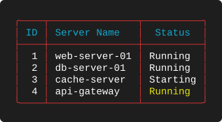
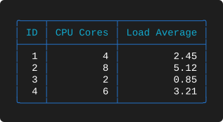
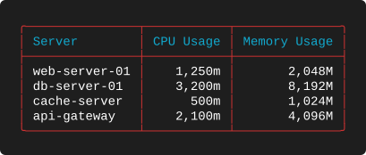
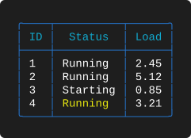
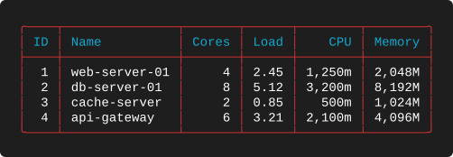
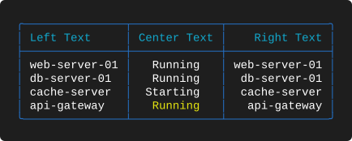
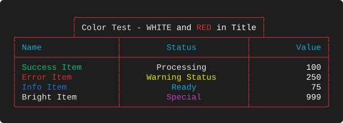
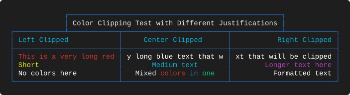
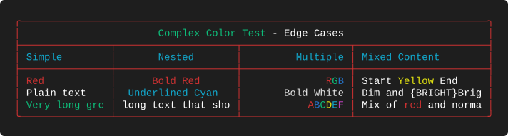

# Examples 01 — Basic Rendering

[← Examples index](EXAMPLES.md) · [Next: Summaries →](EXAMPLES_02.md)

Suite 01 is the foundation layer. It answers the questions you hit in the first five
minutes: how do I pick a theme, what do the datatypes actually do to my values, how do I
align a column, how do I hide a column I only need for processing, and what happens when
my data contains colour markup.

**Source:** [`tests/scenarios/suite_01/`](tests/scenarios/suite_01) · **Examples:** 9 ·
**Run the suite:** `bash tests/run_tests.sh 01`

---

## The data

Examples 1-A through 1-F all read the same four-row server inventory. Holding the data
constant is deliberate: every difference you see between those tables comes from the
layout alone.

```json
[
  {
    "id": 1,
    "name": "web-server-01",
    "cpu_cores": 4,
    "load_avg": 2.45,
    "cpu_usage": "1250m",
    "memory_usage": "2048Mi",
    "status": "Running"
  },
  {
    "id": 2,
    "name": "db-server-01",
    "cpu_cores": 8,
    "load_avg": 5.12,
    "cpu_usage": "3200m",
    "memory_usage": "8192Mi",
    "status": "Running"
  },
  {
    "id": 3,
    "name": "cache-server",
    "cpu_cores": 2,
    "load_avg": 0.85,
    "cpu_usage": "500m",
    "memory_usage": "1024Mi",
    "status": "Starting"
  },
  {
    "id": 4,
    "name": "api-gateway",
    "cpu_cores": 6,
    "load_avg": 3.21,
    "cpu_usage": "2100m",
    "memory_usage": "4096Mi",
    "status": "{YELLOW}Running{RESET}"
  }
]
```

Two details are worth noticing before we start. The `status` value on the last row
contains `{YELLOW}Running{RESET}` — colour markup lives in the *data*, not just the
layout. And `memory_usage` is expressed in Kubernetes units (`2048Mi`), which the `kmem`
datatype will normalise on the way out.

Examples 1-G, 1-H and 1-I use their own, smaller data files built specifically to stress
colour handling; those are shown inline with each example.

---

## 1-A — Text and integer columns with a hidden duplicate

**What it demonstrates.** The minimum viable layout — a theme and a `columns` array —
plus two ideas that are easy to miss: a key may be used by more than one column, and a
column can be present in the layout but absent from the output.

**Layout** — `tests/scenarios/suite_01/test_1_A_layout.json`

```json
{
  "theme": "Red",
  "columns": [
    {
      "header": "ID",
      "key": "id",
      "datatype": "int",
      "justification": "right"
    },
    {
      "header": "ID2",
      "key": "id",
      "datatype": "int",
      "justification": "right",
      "visible": false
    },
    {
      "header": "Server Name",
      "key": "name",
      "datatype": "text",
      "justification": "left"
    },
    {
      "header": "Status",
      "key": "status",
      "datatype": "text",
      "justification": "center"
    }
  ]
}
```

**Output**



**What to look for**

* The table has **three** columns, not four. `ID2` declares `"visible": false`, so it is
  dropped before widths are measured — it contributes nothing to the border geometry.
  This is the mechanism you use when a field is only needed for sorting or for a `break`.
* `ID2` reuses the key `id`. Column keys are not required to be unique; a column is just
  a view onto a field.
* The `Status` column is 10 characters wide because the longest value, `Starting`, is
  eight characters and one space of padding is added on each side. The header `Status`
  is shorter than the data, so the data wins.
* Row 4's status is stored as `{YELLOW}Running{RESET}` but occupies the same width as the
  plain `Running` above it. Placeholders are removed before the width is calculated, so
  colouring a value never shifts a column.

---

## 1-B — Numeric datatypes side by side

**What it demonstrates.** The difference between `int`, `num` and `float`, and the second
theme.

**Layout** — `tests/scenarios/suite_01/test_1_B_layout.json`

```json
{
  "theme": "Blue",
  "columns": [
    {
      "header": "ID",
      "key": "id",
      "datatype": "int",
      "justification": "right"
    },
    {
      "header": "CPU Cores",
      "key": "cpu_cores",
      "datatype": "num",
      "justification": "right"
    },
    {
      "header": "Load Average",
      "key": "load_avg",
      "datatype": "float",
      "justification": "right"
    }
  ]
}
```

**Output**



**What to look for**

* `"theme": "Blue"` changes the border and caption colours — compare the blue frame here
  with 1-A's red one. The theme only ever touches colour, never geometry: put the two
  images side by side and the shapes are identical in construction.
* `int` and `num` render identically here because none of the values reach four digits.
  The distinction only appears once a value crosses 1,000, at which point `num` inserts
  separators and `int` does not — see [1-E](#1-e--all-six-datatypes-in-one-table).
* `float` preserves the two decimal places present in the source (`2.45`, `0.85`).
* Every column is right-justified, which is the conventional choice for numbers: the
  digits line up on the decimal point and the eye can compare magnitudes down the column.

---

## 1-C — Kubernetes CPU and memory normalisation

**What it demonstrates.** The two domain-specific datatypes, `kcpu` and `kmem`, which
parse Kubernetes resource quantities and re-emit them in a canonical form.

**Layout** — `tests/scenarios/suite_01/test_1_C_layout.json`

```json
{
  "theme": "Red",
  "columns": [
    {
      "header": "Server",
      "key": "name",
      "datatype": "text",
      "justification": "left"
    },
    {
      "header": "CPU Usage",
      "key": "cpu_usage",
      "datatype": "kcpu",
      "justification": "right"
    },
    {
      "header": "Memory Usage",
      "key": "memory_usage",
      "datatype": "kmem",
      "justification": "right"
    }
  ]
}
```

**Output**



**What to look for**

* `"1250m"` becomes `1,250m`. `kcpu` always emits the millicore suffix and always applies
  thousands separators, so a column of CPU values is directly comparable by eye.
* `"2048Mi"` becomes `2,048M`. `kmem` normalises the binary suffixes (`Ki`, `Mi`, `Gi`)
  onto `K`, `M` and `G`, again with separators. Input written as `2048M` would render the
  same way.
* Both datatypes are ordinary right-justified columns as far as the frame is concerned;
  the normalisation happens during value formatting, before width measurement.
* Because normalisation is deterministic, these columns can carry a `summary` of `sum`
  and produce a meaningful total — see
  [2-C](EXAMPLES_02.md#2-c--summing-kubernetes-quantities).

---

## 1-D — Centring every column

**What it demonstrates.** `"justification": "center"` applied uniformly, including to a
numeric column, and the rounding rule used when the leftover space cannot be split evenly.

**Layout** — `tests/scenarios/suite_01/test_1_D_layout.json`

```json
{
  "theme": "Blue",
  "columns": [
    {
      "header": "ID",
      "key": "id",
      "datatype": "int",
      "justification": "center"
    },
    {
      "header": "Status",
      "key": "status",
      "datatype": "text",
      "justification": "center"
    },
    {
      "header": "Load",
      "key": "load_avg",
      "datatype": "float",
      "justification": "center"
    }
  ]
}
```

**Output**



**What to look for**

* The `ID` column has a two-character content field (the header `ID` is the widest thing
  in it) and each value is a single digit. The spare column goes to the **right** of the
  value: `1 `, not ` 1`. Odd slack always favours the left edge.
* The same rule governs `Status`: `Running` is seven characters in an eight-character
  field, so it sits one space left of centre.
* Centring a numeric column is legal but rarely wise — `2.45` and `0.85` no longer align
  on the decimal point. Compare with 1-B, where the same field is right-justified.

---

## 1-E — All six datatypes in one table

**What it demonstrates.** `text`, `num`, `float`, `kcpu` and `kmem` in a single layout,
with `int` supplying the row identifier — the whole type system in one view.

**Layout** — `tests/scenarios/suite_01/test_1_E_layout.json`

```json
{
  "theme": "Red",
  "columns": [
    {
      "header": "ID",
      "key": "id",
      "datatype": "int",
      "justification": "right"
    },
    {
      "header": "Name",
      "key": "name",
      "datatype": "text",
      "justification": "left"
    },
    {
      "header": "Cores",
      "key": "cpu_cores",
      "datatype": "num",
      "justification": "right"
    },
    {
      "header": "Load",
      "key": "load_avg",
      "datatype": "float",
      "justification": "right"
    },
    {
      "header": "CPU",
      "key": "cpu_usage",
      "datatype": "kcpu",
      "justification": "right"
    },
    {
      "header": "Memory",
      "key": "memory_usage",
      "datatype": "kmem",
      "justification": "right"
    }
  ]
}
```

**Output**



**What to look for**

* `Cores` (`num`) shows bare digits while `CPU` (`kcpu`) shows `1,250m` and `Memory`
  (`kmem`) shows `2,048M`. Same underlying integers, three different presentations, all
  driven by `datatype`.
* The `ID` column is `int` and stays unseparated. If those identifiers ever exceeded 999
  you would not want `1,024` as a row number — that is exactly the choice `int` versus
  `num` is there to give you.
* Six columns produce six independently measured widths. Nothing is padded to a common
  size; each column is only as wide as it needs to be.

---

## 1-F — One value, three justifications

**What it demonstrates.** The clearest possible comparison of the three alignments, by
pointing two columns at the same key and varying only `justification`.

**Layout** — `tests/scenarios/suite_01/test_1_F_layout.json`

```json
{
  "theme": "Blue",
  "columns": [
    {
      "header": "Left Text",
      "key": "name",
      "datatype": "text",
      "justification": "left"
    },
    {
      "header": "Center Text",
      "key": "status",
      "datatype": "text",
      "justification": "center"
    },
    {
      "header": "Right Text",
      "key": "name",
      "datatype": "text",
      "justification": "right"
    }
  ]
}
```

**Output**



**What to look for**

* `Left Text` and `Right Text` render the identical `name` field. The left column's
  values start flush against the padding; the right column's values end flush against it.
  Both columns are the same width, because both measure the same content.
* Header alignment follows the column's justification too — `Right Text` is pushed to the
  right of its own cell. Headers and data are always aligned the same way; there is no
  separate header justification setting.
* The centre column shows the ragged-both-edges effect that makes centring a poor default
  for anything you intend to scan vertically.

---

## 1-G — Colour placeholders in data and title

**What it demonstrates.** `{COLOR}` markup in cell values *and* in the title, combined
with fixed column widths.

**Data** — `tests/scenarios/suite_01/test_1_G_data.json`

```json
[
  {
    "name": "{GREEN}Success Item{RESET}",
    "status": "{WHITE}Processing{RESET}",
    "value": 100
  },
  {
    "name": "{RED}Error Item{RESET}",
    "status": "{YELLOW}Warning Status{RESET}",
    "value": 250
  },
  {
    "name": "{BLUE}Info Item{RESET}",
    "status": "{CYAN}Ready{RESET}",
    "value": 75
  },
  {
    "name": "{WHITE}Bright Item{RESET}",
    "status": "{MAGENTA}Special{RESET}",
    "value": 999
  }
]
```

**Layout** — `tests/scenarios/suite_01/test_1_G_layout.json`

```json
{
  "theme": "Red",
  "title": "Color Test - {WHITE}WHITE{RESET} and {RED}RED{RESET} in Title",
  "title_position": "center",
  "columns": [
    {
      "header": "Name",
      "key": "name",
      "justification": "left",
      "datatype": "text",
      "width": 20
    },
    {
      "header": "Status",
      "key": "status",
      "justification": "center",
      "datatype": "text",
      "width": 25
    },
    {
      "header": "Value",
      "key": "value",
      "justification": "right",
      "datatype": "int",
      "width": 15
    }
  ]
}
```

**Output**



**What to look for**

* Each value carries its own colour, and the title contains two differently coloured
  words (`WHITE` and `RED`). Run this one with `--mono` and the markup is stripped
  entirely — the text closes up seamlessly with no gap left behind.
* The recognised placeholders are `{RED}`, `{GREEN}`, `{BLUE}`, `{YELLOW}`, `{CYAN}`,
  `{MAGENTA}`, `{WHITE}`, `{BOLD}`, `{DIM}`, `{UNDERLINE}` and the two equivalent
  terminators `{RESET}` and `{NC}`.
* `width` is set explicitly on all three columns (20, 25 and 15). Those numbers are the
  **total** cell width including padding, so the `Name` column has 18 characters of usable
  content space. The widths are honoured even though the content is far shorter, which is
  how you stop a table from twitching between runs as the data changes.
* The title is narrower than the table, so it renders as its own box centred over the
  frame, with the top border stitching around it.

---

## 1-H — Clipping coloured text

**What it demonstrates.** What happens when coloured content is too wide for its column,
and how the surviving fragment depends on the column's justification.

**Data** — `tests/scenarios/suite_01/test_1_H_data.json`

```json
[
  {
    "left_text": "{RED}This is a very long red text that will be clipped{RESET}",
    "center_text": "{BLUE}This is a very long blue text that will be clipped{RESET}",
    "right_text": "{GREEN}This is a very long green text that will be clipped{RESET}"
  },
  {
    "left_text": "{YELLOW}Short{RESET}",
    "center_text": "{CYAN}Medium text{RESET}",
    "right_text": "{MAGENTA}Longer text here{RESET}"
  },
  {
    "left_text": "No colors here",
    "center_text": "{WHITE}Mixed {RED}colors {BLUE}in {GREEN}one{RESET}",
    "right_text": "{BOLD}{UNDERLINE}Formatted text{RESET}"
  }
]
```

**Layout** — `tests/scenarios/suite_01/test_1_H_layout.json`

```json
{
  "theme": "Blue",
  "title": "{BOLD}Color Clipping Test with Different Justifications{RESET}",
  "title_position": "center",
  "columns": [
    {
      "header": "Left Clipped",
      "key": "left_text",
      "justification": "left",
      "datatype": "text",
      "width": 25
    },
    {
      "header": "Center Clipped",
      "key": "center_text",
      "justification": "center",
      "datatype": "text",
      "width": 25
    },
    {
      "header": "Right Clipped",
      "key": "right_text",
      "justification": "right",
      "datatype": "text",
      "width": 25
    }
  ]
}
```

**Output**



**What to look for**

* All three columns are 25 wide (23 characters of content) and all three first-row values
  are far longer than that. The clipping is not uniform:
  * left column keeps the **head** — `This is a very long red`
  * centre column keeps the **middle** — `y long blue text that w`
  * right column keeps the **tail** — `xt that will be clipped`
* This is the single most useful rule in the whole library: **clipping preserves the edge
  the text is justified against.** A right-justified path column will keep the filename;
  a left-justified one will keep the mount point.
* Clipping happens on the *visible* text. The colour markup surrounding the clipped region
  is handled separately so the escape sequences stay balanced — a clipped coloured string
  never leaks its colour into the border.
* Row 3's centre cell mixes four placeholders inside one value
  (`{WHITE}Mixed {RED}colors {BLUE}in {GREEN}one{RESET}`) and still measures as the
  19-character phrase `Mixed colors in one`.
* Default clipping behaviour applies because `wrap_mode` is left at its default of
  `clip`. Suite 03 covers the alternative.

---

## 1-I — Nested and multiple placeholders

**What it demonstrates.** Edge cases in placeholder parsing: nesting, back-to-back colour
changes, partial colouring of a value — and what happens to a token that merely *looks*
like a placeholder.

**Data** — `tests/scenarios/suite_01/test_1_I_data.json`

```json
[
  {
    "simple": "{RED}Red{RESET}",
    "nested": "{BOLD}{RED}Bold Red{RESET}{RESET}",
    "multiple": "{RED}R{GREEN}G{BLUE}B{RESET}",
    "mixed": "Start {YELLOW}Yellow{RESET} End"
  },
  {
    "simple": "Plain text",
    "nested": "{UNDERLINE}{CYAN}Underlined Cyan{RESET}",
    "multiple": "{WHITE}{BOLD}Bold White{RESET}",
    "mixed": "{DIM}Dim{RESET} and {BRIGHT}Bright{RESET}"
  },
  {
    "simple": "{GREEN}Very long green text that should be clipped{RESET}",
    "nested": "No color but very long text that should also be clipped",
    "multiple": "{RED}A{BLUE}B{GREEN}C{YELLOW}D{CYAN}E{MAGENTA}F{RESET}",
    "mixed": "Mix of {RED}red{RESET} and normal text here"
  }
]
```

**Layout** — `tests/scenarios/suite_01/test_1_I_layout.json`

```json
{
  "theme": "Red",
  "title": "{GREEN}Complex Color Test{RESET} - {BOLD}Edge Cases{RESET}",
  "title_position": "full",
  "columns": [
    {
      "header": "Simple",
      "key": "simple",
      "justification": "left",
      "datatype": "text",
      "width": 15
    },
    {
      "header": "Nested",
      "key": "nested",
      "justification": "center",
      "datatype": "text",
      "width": 20
    },
    {
      "header": "Multiple",
      "key": "multiple",
      "justification": "right",
      "datatype": "text",
      "width": 18
    },
    {
      "header": "Mixed Content",
      "key": "mixed",
      "justification": "left",
      "datatype": "text",
      "width": 22
    }
  ]
}
```

**Output**



**What to look for**

* `"{RED}R{GREEN}G{BLUE}B{RESET}"` measures as three characters and renders as `RGB`.
  Consecutive placeholders with no text between them cost nothing in width.
* `{BOLD}{RED}Bold Red{RESET}{RESET}` shows that attributes stack and that a redundant
  second terminator is harmless.
* **`{BRIGHT}` is not a recognised placeholder.** Look at the second row of the
  `Mixed Content` column: it renders as `Dim and {BRIGHT}Brig`, with the literal braces
  intact and the value clipped at 20 characters. An unknown token is treated as ordinary
  text and therefore *does* consume width. If a value comes out mysteriously short, check
  your placeholder spelling against the supported list.
* `"title_position": "full"` stretches the title bar across the entire table width and
  centres the text inside it, rather than drawing a narrow box. Suites 05 and 06 explore
  the positions in depth.

---

## Takeaways

* A layout needs only `theme` and `columns`; everything else has a sensible default.
* `datatype` controls formatting, not just validation — `num`, `kcpu` and `kmem` actively
  rewrite the value before it is measured.
* Widths are computed from the widest of the header and the formatted data, plus padding,
  unless you pin them with `width`.
* Colour markup is invisible to the width calculation, so it can never break alignment —
  provided the placeholder is one the renderer knows.
* When content does not fit, the text is clipped toward the edge it is justified against.

---

[← Examples index](EXAMPLES.md) · [Next: Summaries →](EXAMPLES_02.md)
