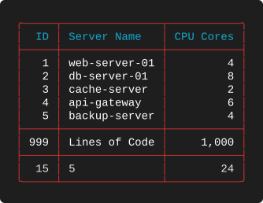

# Examples 02 — Summaries

[← Basic Rendering](EXAMPLES_01.md) · [Examples index](EXAMPLES.md) · [Next: Clipping and Wrapping →](EXAMPLES_03.md)

Suite 02 is about the row at the bottom. Setting `summary` on a column adds an
aggregation rule; if any column in the layout has one, a separator and a summary row are
appended to the table. This suite walks every aggregation the library supports, shows how
each behaves against integers, floats, text and Kubernetes quantities, and covers the two
mechanisms for keeping specific values out of the arithmetic.

**Source:** [`tests/scenarios/suite_02/`](tests/scenarios/suite_02) · **Examples:** 10 ·
**Run the suite:** `bash tests/run_tests.sh 02`

---

## The data

Examples 2-A through 2-I share a five-row dataset. It is deliberately awkward: it contains
nulls, numeric zeros, an empty string, and a fifth server whose resource usage is zero.

```json
[
  {
    "id": 1,
    "name": "web-server-01",
    "cpu_cores": 4,
    "load_avg": 2.45,
    "cpu_usage": "1250m",
    "memory_usage": "2048Mi",
    "status": "Running",
    "test_int": 100,
    "test_float": 1.23,
    "test_string": "hello"
  },
  {
    "id": 2,
    "name": "db-server-01",
    "cpu_cores": 8,
    "load_avg": 5.12,
    "cpu_usage": "3200m",
    "memory_usage": "8192Mi",
    "status": "Running",
    "test_int": 0,
    "test_float": 0.0,
    "test_string": ""
  },
  {
    "id": 3,
    "name": "cache-server",
    "cpu_cores": 2,
    "load_avg": 0.85,
    "cpu_usage": "500m",
    "memory_usage": "1024Mi",
    "status": "Starting",
    "test_int": null,
    "test_float": null,
    "test_string": null
  },
  {
    "id": 4,
    "name": "api-gateway",
    "cpu_cores": 6,
    "load_avg": 3.21,
    "cpu_usage": "2100m",
    "memory_usage": "4096Mi",
    "status": "Running",
    "test_int": 200,
    "test_float": 4.56,
    "test_string": "world"
  },
  {
    "id": 5,
    "name": "backup-server",
    "cpu_cores": 4,
    "load_avg": 1.5,
    "cpu_usage": "0m",
    "memory_usage": "0Mi",
    "status": "Idle",
    "test_int": 0,
    "test_float": 0.0,
    "test_string": ""
  }
]
```

Row 3 (`cache-server`) has `null` in all three `test_*` fields. Rows 2 and 5 have `0`,
`0.0` and `""`. Those are the values that separate a `count` from a `nonblanks`, and they
are why this dataset exists.

Example 2-J uses its own data file, shown with that example.

## The summary vocabulary

| Summary | Applies to | Produces |
|---------|-----------|----------|
| `sum` | `int`, `num`, `float`, `kcpu`, `kmem` | Total of all non-annotated values |
| `min` / `max` | numeric types | Smallest / largest value |
| `avg` | numeric types | Mean, formatted using the column's own datatype |
| `count` | any | Number of rows contributing a value |
| `unique` | any | Number of distinct values |
| `blanks` | any | Number of rows rendering as blank |
| `nonblanks` | any | Number of rows rendering as something |
| `none` | any | No summary for this column (the default) |

Summary cells obey the column's `justification`, and numeric summaries are formatted with
the same datatype rules as the body, so a `num` total keeps its thousands separators and a
`kcpu` total keeps its `m` suffix.

---

## 2-A — Sum and count
**What it demonstrates.** The two aggregations you will reach for first, and the fact that
a `count` is perfectly legal on a text column.

**Layout** — `tests/scenarios/suite_02/test_2_A_layout.json`

```json
{
  "theme": "Red",
  "columns": [
    {
      "header": "ID",
      "key": "id",
      "datatype": "int",
      "justification": "right",
      "summary": "sum"
    },
    {
      "header": "Server Name",
      "key": "name",
      "datatype": "text",
      "justification": "left",
      "summary": "count"
    },
    {
      "header": "CPU Cores",
      "key": "cpu_cores",
      "datatype": "num",
      "justification": "right",
      "summary": "sum"
    }
  ]
}
```

**Output**



**What to look for**

* Six rows are rendered, but the totals describe only five. `ID` sums to **15**, not 1014;
  `CPU Cores` sums to **24**, not 1024; `Server Name` counts **5**, not 6. The
  `"annotate": true` row is displayed and then skipped by every aggregation.
* The annotated row *does* affect layout. `ID` is three characters wide to fit `999`, and
  `CPU Cores` is wide enough for `1,000`. Annotated rows participate in width measurement
  and in `break` evaluation; they are excluded from arithmetic only.
* The `group` column is `"visible": false` with `"break": true`. It never appears, but
  because its value changes from `data` to `note` on the last row, a separator is drawn
  above the annotation. This is the idiomatic way to insert a rule at an arbitrary point:
  add a hidden column whose value changes exactly where you want the line.
* The result is a table with two visually distinct trailing rows — an informational line
  and a genuine total — which is exactly how the project's own performance table reports
  lines of code alongside timings.

---

## Takeaways

* Any `summary` anywhere in the layout adds the separator and the summary row; there is no
  separate switch.
* Summary values are formatted by their own column, so `int` rounds, `float` keeps
  decimals, `num` separates thousands and `kcpu`/`kmem` keep their suffixes.
* `count` counts rows, `unique` counts distinct values, `blanks`/`nonblanks` count what is
  visible after `null_value` and `zero_value` have been applied.
* Summary values are measured when computing column widths.
* Use `"annotate": true` for rows that belong in the body but not in the totals, and pair
  it with a hidden `break` column when you want a rule drawn around them.

---

[← Basic Rendering](EXAMPLES_01.md) · [Examples index](EXAMPLES.md) · [Next: Clipping and Wrapping →](EXAMPLES_03.md)
