# Examples 03 — Clipping and Wrapping

[← Summaries](EXAMPLES_02.md) · [Examples index](EXAMPLES.md) · [Next: Combined Features →](EXAMPLES_04.md)

Suite 03 is about the moment your content stops fitting. Terminal Tables offers two
strategies — clip the text, or wrap it onto extra lines — and each interacts with the
column's `justification` in a way that is worth internalising. This suite isolates every
combination: no constraint at all, clipping in three alignments, word wrapping, wrapping on
a delimiter in three alignments, and wrapping combined with group separators.

**Source:** [`tests/scenarios/suite_03/`](tests/scenarios/suite_03) · **Examples:** 11 ·
**Run the suite:** `bash tests/run_tests.sh 03`

---

## The data

All eleven examples read the same five rows. Row 2 carries a deliberately enormous
`description` (just over 300 characters) and an unusually long `tags` list; everything else
is short. That contrast is what makes the constraint visible.

```json
[
  {
    "id": 1,
    "category": "Web",
    "description": "Primary",
    "tags": "frontend,app,ui"
  },
  {
    "id": 2,
    "category": "Web",
    "description": "Secondary web server with a very long description to test wrapping functionality. This description is extended to be over 125 characters to ensure that it will wrap when a width of 75 is set in the test. Additional text is added here to meet the length requirement for thorough testing of wrapping behavior.",
    "tags": "frontend,backup,loadbalancer,highavailability,performance"
  },
  {
    "id": 3,
    "category": "Database",
    "description": "Main database server",
    "tags": "db,sql,storage"
  },
  {
    "id": 4,
    "category": "Database",
    "description": "Replica database",
    "tags": "db,replica,read"
  },
  {
    "id": 5,
    "category": "Cache",
    "description": "In-memory cache",
    "tags": "cache,redis,fast"
  }
]
```

The `tags` field is a comma-separated string rather than an array. That is intentional —
it is the shape you get out of most exports, and it is what `wrap_char` is designed to
handle.

## The three controls

| Field | Meaning |
|-------|---------|
| `width` | Total cell width **including** padding. A `width` of 15 with the default padding of 1 leaves 13 characters of content space. `0`, the default, means "measure the content". |
| `wrap_mode` | `clip` (default) truncates the value to fit; `wrap` splits it across as many lines as needed. |
| `wrap_char` | When wrapping, break at this character instead of at spaces. Typically `,`. |

`width` is the trigger for both behaviours. Without it there is nothing to overflow, so
`wrap_mode` and `wrap_char` have no effect.

---

## 3-A — No width means no limit
**What it demonstrates.** The baseline. With no `width`, a column grows to fit its widest
value, however absurd that is.

**Layout** — `tests/scenarios/suite_03/test_3_A_layout.json`

```json
{
  "theme": "Red",
  "columns": [
    {
      "header": "ID",
      "key": "id",
      "datatype": "int",
      "justification": "right"
    },
    {
      "header": "Category",
      "key": "category",
      "datatype": "text",
      "justification": "left"
    },
    {
      "header": "Description",
      "key": "description",
      "datatype": "text",
      "justification": "left"
    }
  ]
}
```

**Output** *(this block scrolls horizontally — the real line is 327 characters wide)*

**Output**

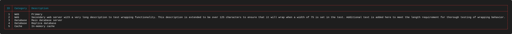


**What to look for**

* The `Description` column is sized by row 2 alone, and the whole table inherits that
  width. The other four descriptions sit in a sea of padding.
* Nothing is lost and nothing is truncated. If you are piping into a file or a wide
  terminal, this is the correct behaviour — and it is why `width` is opt-in rather than
  defaulted to the terminal size.
* Everything that follows in this suite is a different answer to the same question: what
  should the other 300 columns have done instead?

---

## 3-B — A fixed width clips from the right
**What it demonstrates.** The default overflow behaviour, `clip`, on a left-justified
column.

**Layout** — `tests/scenarios/suite_03/test_3_B_layout.json`

```json
{
  "theme": "Blue",
  "columns": [
    {
      "header": "ID",
      "key": "id",
      "datatype": "int",
      "justification": "right"
    },
    {
      "header": "Category",
      "key": "category",
      "datatype": "text",
      "justification": "left"
    },
    {
      "header": "Description",
      "key": "description",
      "datatype": "text",
      "justification": "left",
      "width": 10
    }
  ]
}
```

**Output**


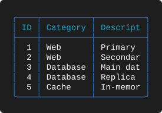

**What to look for**

* `"width": 10` yields eight characters of content. Every description is cut to eight
  characters, keeping the beginning: `Secondar`, `Main dat`, `In-memor`.
* **The header is clipped too.** `Description` becomes `Descript`. A `width` is a hard
  constraint on the column, not just on the data, so check that your headers survive it.
* There is no ellipsis or marker. Clipping is silent, which keeps the geometry exact but
  means a truncated column can be mistaken for a short value. If that matters, wrap
  instead.
* `Replica database` and `Primary` are also affected — `Replica ` keeps its trailing space
  in the eight-character field, which is why row 4 looks like it has an extra gap.

---

## 3-C — Right-justified clipping keeps the tail
**What it demonstrates.** The same clip against a right-justified column, which preserves
the opposite end of the string.

**Layout** — `tests/scenarios/suite_03/test_3_C_layout.json`

```json
{
  "theme": "Red",
  "columns": [
    {
      "header": "ID",
      "key": "id",
      "datatype": "int",
      "justification": "right"
    },
    {
      "header": "Category",
      "key": "category",
      "datatype": "text",
      "justification": "left"
    },
    {
      "header": "Description",
      "key": "description",
      "datatype": "text",
      "justification": "right",
      "width": 11
    }
  ]
}
```

**Output**


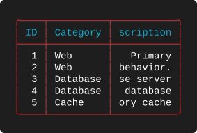

**What to look for**

* Nine characters of content this time, and every value keeps its **end**: `behavior.`,
  `se server`, ` database`, `ory cache`.
* The header follows the same rule — `Description` becomes `scription`, losing its first
  two characters rather than its last two.
* Compare directly with 3-B. Same data, same clip, opposite survivor. The rule is: the text
  is anchored to the edge it is justified against, and the far end is what falls off.
* This is the behaviour you want for file paths, hostnames with long domain prefixes, git
  hashes, and anything else whose distinguishing part is at the end.

---

## 3-D — Centred clipping keeps the middle
**What it demonstrates.** The third case, completing the pattern.

**Layout** — `tests/scenarios/suite_03/test_3_D_layout.json`

```json
{
  "theme": "Blue",
  "columns": [
    {
      "header": "ID",
      "key": "id",
      "datatype": "int",
      "justification": "right"
    },
    {
      "header": "Category",
      "key": "category",
      "datatype": "text",
      "justification": "left"
    },
    {
      "header": "Description",
      "key": "description",
      "datatype": "text",
      "justification": "center",
      "width": 15
    }
  ]
}
```

**Output**


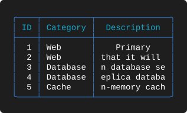

**What to look for**

* Thirteen characters of content, and each value loses material from **both** ends:
  `that it will `, `n database se`, `eplica databa`, `n-memory cach`.
* The header `Description` is 11 characters, which fits inside 13, so it is centred rather
  than clipped. A column can clip its data and not its header, or vice versa.
* Centred clipping is rarely what you want for real data — it destroys both the prefix and
  the suffix — but it completes the mental model: **clipping always removes the material
  furthest from the justified edge.**

---

## 3-E — Wrapping on a delimiter with `wrap_char`
**What it demonstrates.** `wrap_mode: "wrap"` combined with `wrap_char: ","`, turning a
comma-separated field into a vertical list.

**Layout** — `tests/scenarios/suite_03/test_3_E_layout.json`

```json
{
  "theme": "Red",
  "columns": [
    {
      "header": "ID",
      "key": "id",
      "datatype": "int",
      "justification": "right"
    },
    {
      "header": "Category",
      "key": "category",
      "datatype": "text",
      "justification": "left"
    },
    {
      "header": "Tags",
      "key": "tags",
      "datatype": "text",
      "justification": "left",
      "width": 15,
      "wrap_mode": "wrap",
      "wrap_char": ","
    }
  ]
}
```

**Output**


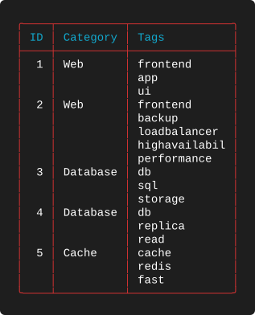

**What to look for**

* Each tag lands on its own line and the delimiter itself is consumed — the commas are
  gone. This is the single most useful trick in the library for rendering list-valued
  fields.
* A row now occupies as many lines as it has tags. Row 2 has five tags and therefore five
  lines; rows 1, 3, 4 and 5 have three each.
* Continuation lines leave the other columns **blank**, not repeated. The `ID` and
  `Category` values appear once, on the first line of their row, which keeps the visual
  grouping obvious without any extra configuration.
* Row 2's fourth tag, `highavailability`, is 16 characters in a 13-character field. It
  cannot be split further, so it is clipped to `highavailabil` — wrapping and clipping are
  not mutually exclusive. Wrapping happens first; anything still too wide is then clipped.

---

## 3-F — Word wrapping with `wrap_mode`
**What it demonstrates.** `wrap_mode: "wrap"` with no `wrap_char`, which falls back to
breaking at word boundaries.

**Layout** — `tests/scenarios/suite_03/test_3_F_layout.json`

```json
{
  "theme": "Blue",
  "columns": [
    {
      "header": "ID",
      "key": "id",
      "datatype": "int",
      "justification": "right"
    },
    {
      "header": "Category",
      "key": "category",
      "datatype": "text",
      "justification": "left"
    },
    {
      "header": "Description",
      "key": "description",
      "datatype": "text",
      "justification": "left",
      "width": 20,
      "wrap_mode": "wrap"
    }
  ]
}
```

**Output**


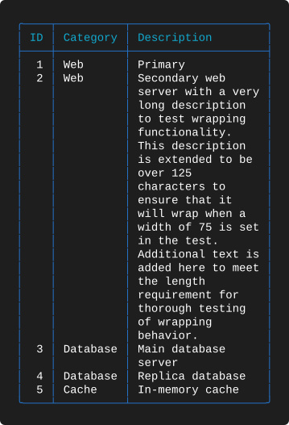

**What to look for**

* Row 2's 300-character description becomes a 20-line paragraph inside an 18-character
  content field, and no word is broken across a line.
* The wrap is greedy: each line takes as many whole words as fit. Lines therefore have
  ragged right edges (`over 125`, `the length`), which is correct word wrapping rather than
  a defect.
* Short rows are unaffected. `Primary`, `Replica database` and `In-memory cache` each fit
  on one line, so the table only pays for the height it needs.
* Compare with 3-B: same overflowing field, same table shape, entirely different answer.
  `clip` optimises for a fixed row height; `wrap` optimises for not losing information.

---

## 3-G — `break` inserts a separator when a value changes
**What it demonstrates.** Group separators, and how they combine with a clipped column.

**Layout** — `tests/scenarios/suite_03/test_3_G_layout.json`

```json
{
  "theme": "Red",
  "columns": [
    {
      "header": "ID",
      "key": "id",
      "datatype": "int",
      "justification": "right"
    },
    {
      "header": "Category",
      "key": "category",
      "datatype": "text",
      "justification": "left",
      "break": true
    },
    {
      "header": "Description",
      "key": "description",
      "datatype": "text",
      "justification": "left",
      "width": 20
    }
  ]
}
```

**Output**


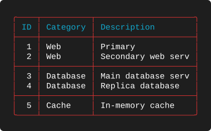

**What to look for**

* `Category` carries `"break": true`, so a full-width rule is drawn every time the value
  differs from the row above: after the two `Web` rows, and after the two `Database` rows.
  No rule is drawn before the first row or after the last.
* The comparison is strictly against the **previous row**, not a global grouping. The data
  here happens to arrive already grouped. If `Web`, `Database`, `Web` appeared in that
  order you would get three groups, not two — which is why `break` is usually paired with
  `sort`.
* `Description` is clipped at 20 (18 characters of content) and the breaks do not interact
  with that at all. Breaks are a row-level feature; clipping is a cell-level one.

---

## 3-H — Breaks, clipping and delimiter wrapping together
**What it demonstrates.** Three constraints in one table: a `break` column, a clipped
column, and a delimiter-wrapped column that makes rows multiple lines tall.

**Layout** — `tests/scenarios/suite_03/test_3_H_layout.json`

```json
{
  "theme": "Blue",
  "columns": [
    {
      "header": "ID",
      "key": "id",
      "datatype": "int",
      "justification": "right"
    },
    {
      "header": "Category",
      "key": "category",
      "datatype": "text",
      "justification": "left",
      "break": true
    },
    {
      "header": "Description",
      "key": "description",
      "datatype": "text",
      "justification": "left",
      "width": 15
    },
    {
      "header": "Tags",
      "key": "tags",
      "datatype": "text",
      "justification": "left",
      "width": 10,
      "wrap_mode": "wrap",
      "wrap_char": ","
    }
  ]
}
```

**Output**


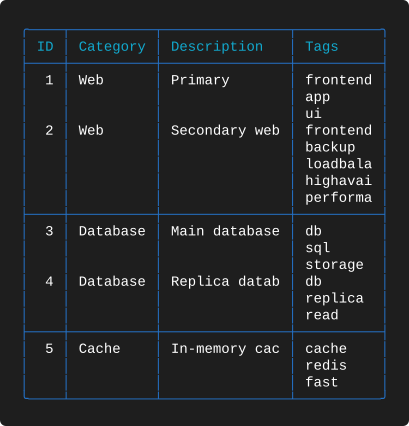

**What to look for**

* Row height is set by the tallest cell in the row — here always the `Tags` column. The
  clipped `Description` occupies only the first line of each row.
* The break rules land **between** rows, never inside one. Row 2 is five lines tall and the
  separator that follows it is drawn after all five, so a multi-line row is never split by
  a group rule.
* `Tags` is only 10 wide (8 characters of content), so several tags are both wrapped and
  clipped: `loadbala`, `highavai`, `performa`. Narrowing a wrapped column does not add more
  lines, it truncates each one.
* This example is the closest thing in the suite to a real report. It is worth reading
  alongside [4-A](EXAMPLES_04.md#4-a--breaks-summaries-and-a-wrapped-description), which
  adds summaries on top.

---

## 3-I — Right-justified delimiter wrapping
**What it demonstrates.** The same `wrap_char` list as 3-E, but right-justified — which
changes both where the tags sit and which part of an over-long tag survives.

**Layout** — `tests/scenarios/suite_03/test_3_I_layout.json`

```json
{
  "theme": "Red",
  "columns": [
    {
      "header": "ID",
      "key": "id",
      "datatype": "int",
      "justification": "right"
    },
    {
      "header": "Category",
      "key": "category",
      "datatype": "text",
      "justification": "left"
    },
    {
      "header": "Tags",
      "key": "tags",
      "datatype": "text",
      "justification": "right",
      "width": 15,
      "wrap_mode": "wrap",
      "wrap_char": ","
    }
  ]
}
```

**Output**


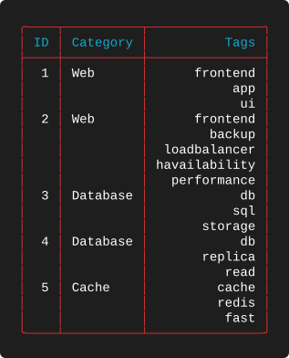

**What to look for**

* Every tag is flush with the right edge of its column, producing a clean right margin
  down the list.
* `highavailability` is clipped to `havailability` — the **tail**, not the head. The
  clipping rule from 3-C applies inside a wrapped cell exactly as it does in an unwrapped
  one.
* Set this side by side with 3-E. The layouts differ in one field, `justification`, and
  yet both the alignment and the surviving text change.

---

## 3-J — Centred delimiter wrapping
**What it demonstrates.** The final corner of the wrap × justification matrix.

**Layout** — `tests/scenarios/suite_03/test_3_J_layout.json`

```json
{
  "theme": "Blue",
  "columns": [
    {
      "header": "ID",
      "key": "id",
      "datatype": "int",
      "justification": "right"
    },
    {
      "header": "Category",
      "key": "category",
      "datatype": "text",
      "justification": "left"
    },
    {
      "header": "Tags",
      "key": "tags",
      "datatype": "text",
      "justification": "center",
      "width": 15,
      "wrap_mode": "wrap",
      "wrap_char": ","
    }
  ]
}
```

**Output**


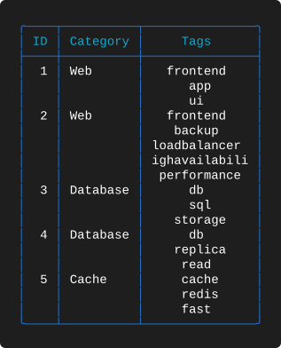

**What to look for**

* Each tag is centred independently, so the list has ragged edges on both sides. For short
  tag lists this reads as a tidy label stack; for long ones it is harder to scan than
  either 3-E or 3-I.
* `highavailability` is clipped to `ighavailabili` — material lost from both ends, matching
  the centred clip in 3-D.
* Together, 3-E, 3-I and 3-J demonstrate that `justification` is applied per wrapped line,
  not once per cell.

---

## 3-K — Wide column wrapping
**What it demonstrates.** The same word wrapping as 3-F at a realistic report width,
showing that `width` is a design decision rather than an emergency brake.

**Layout** — `tests/scenarios/suite_03/test_3_K_layout.json`

```json
{
  "theme": "Red",
  "columns": [
    {
      "header": "ID",
      "key": "id",
      "datatype": "int",
      "justification": "right"
    },
    {
      "header": "Category",
      "key": "category",
      "datatype": "text",
      "justification": "left"
    },
    {
      "header": "Description",
      "key": "description",
      "datatype": "text",
      "justification": "left",
      "width": 75,
      "wrap_mode": "wrap"
    }
  ]
}
```

**Output**


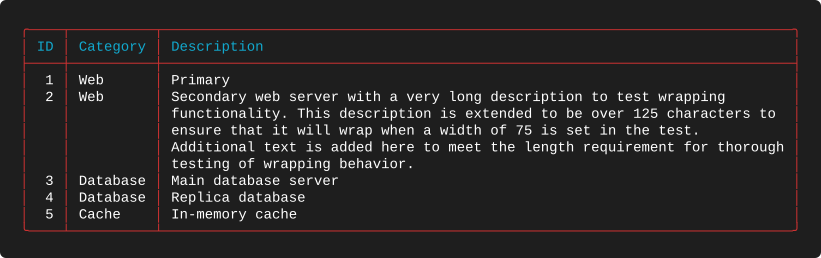

**What to look for**

* `"width": 75` gives 73 characters of content, and the 300-character description folds
  neatly into five lines. The table is 93 columns wide overall — wide, but printable.
* Compare against 3-A, which rendered the same data at 327 columns. One field turned an
  unusable table into a readable one.
* Setting a `width` on your one prose column, and leaving every other column to
  auto-measure, is the most common real-world layout in this whole catalogue.

---

## Takeaways

* `width` includes padding. Subtract two (with the default padding of 1) to get usable
  content space.
* Without `width` there is no overflow, and `wrap_mode`/`wrap_char` do nothing.
* Clipping preserves the edge the text is justified against: head for `left`, tail for
  `right`, middle for `center`.
* Headers are clipped by the same rule as data.
* `wrap` splits on spaces by default, or on `wrap_char` when set; the delimiter is
  consumed.
* Wrapping runs before clipping — a single token longer than the column is wrapped onto its
  own line and then clipped.
* Continuation lines blank out the other columns, and row height is the tallest cell in the
  row.
* `break` rules are drawn between rows, never inside a multi-line row.

---

[← Summaries](EXAMPLES_02.md) · [Examples index](EXAMPLES.md) · [Next: Combined Features →](EXAMPLES_04.md)
