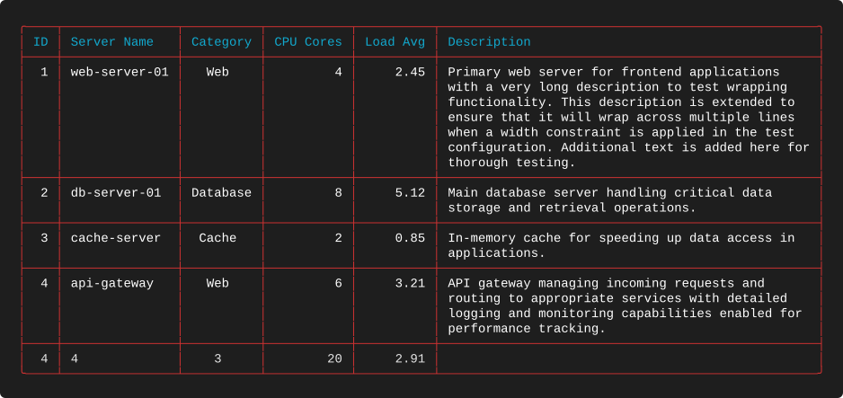
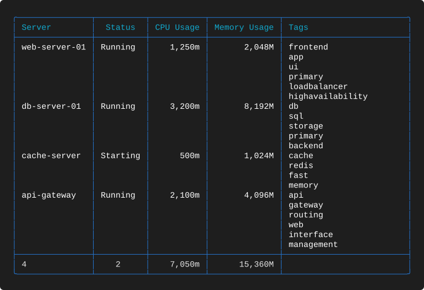
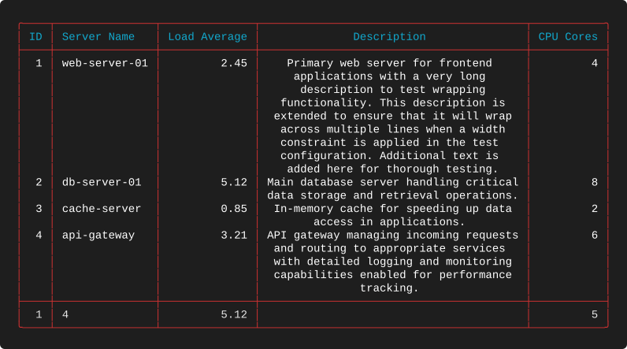
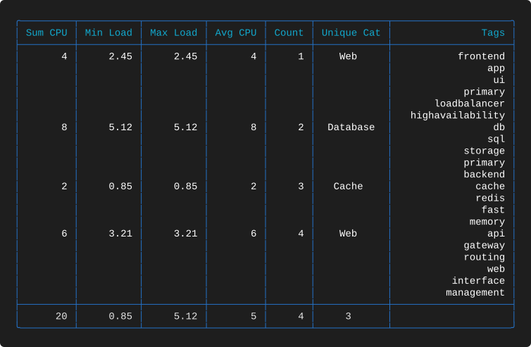
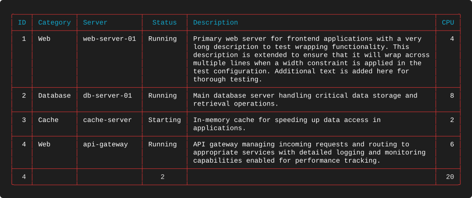

# Examples 04 — Combined Features

[← Clipping and Wrapping](EXAMPLES_03.md) · [Examples index](EXAMPLES.md) · [Next: Titles →](EXAMPLES_05.md)

The first three suites isolate one behaviour at a time. Suite 04 puts them back together:
five layouts that each combine breaks, summaries, wrapping and mixed datatypes the way a
real report does. These are the examples to copy from when you are building something for
production rather than learning a field.

**Source:** [`tests/scenarios/suite_04/`](tests/scenarios/suite_04) · **Examples:** 5 ·
**Run the suite:** `bash tests/run_tests.sh 04`

---

## The data

All five examples share a four-row dataset with long prose in `description`, a
comma-separated `tags` list, Kubernetes quantities, and a `category` suitable for grouping.

```json
[
  {
    "id": 1,
    "server_name": "web-server-01",
    "category": "Web",
    "cpu_cores": 4,
    "load_avg": 2.45,
    "cpu_usage": "1250m",
    "memory_usage": "2048Mi",
    "status": "Running",
    "description": "Primary web server for frontend applications with a very long description to test wrapping functionality. This description is extended to ensure that it will wrap across multiple lines when a width constraint is applied in the test configuration. Additional text is added here for thorough testing.",
    "tags": "frontend,app,ui,primary,loadbalancer,highavailability"
  },
  {
    "id": 2,
    "server_name": "db-server-01",
    "category": "Database",
    "cpu_cores": 8,
    "load_avg": 5.12,
    "cpu_usage": "3200m",
    "memory_usage": "8192Mi",
    "status": "Running",
    "description": "Main database server handling critical data storage and retrieval operations.",
    "tags": "db,sql,storage,primary,backend"
  },
  {
    "id": 3,
    "server_name": "cache-server",
    "category": "Cache",
    "cpu_cores": 2,
    "load_avg": 0.85,
    "cpu_usage": "500m",
    "memory_usage": "1024Mi",
    "status": "Starting",
    "description": "In-memory cache for speeding up data access in applications.",
    "tags": "cache,redis,fast,memory"
  },
  {
    "id": 4,
    "server_name": "api-gateway",
    "category": "Web",
    "cpu_cores": 6,
    "load_avg": 3.21,
    "cpu_usage": "2100m",
    "memory_usage": "4096Mi",
    "status": "Running",
    "description": "API gateway managing incoming requests and routing to appropriate services with detailed logging and monitoring capabilities enabled for performance tracking.",
    "tags": "api,gateway,routing,web,interface,management"
  }
]
```

Note the row order: `Web`, `Database`, `Cache`, `Web`. The category is **not** sorted, and
suite 04 does not sort it. That turns out to be instructive.

---

## 4-A — Breaks, summaries and a wrapped description
**What it demonstrates.** The canonical combination — group separators, five different
summaries, and a wide wrapped prose column — plus what `break` does to unsorted data.

**Layout** — `tests/scenarios/suite_04/test_4_A_layout.json`

```json
{
  "theme": "Red",
  "columns": [
    {
      "header": "ID",
      "key": "id",
      "datatype": "int",
      "justification": "right",
      "summary": "count"
    },
    {
      "header": "Server Name",
      "key": "server_name",
      "datatype": "text",
      "justification": "left",
      "summary": "count"
    },
    {
      "header": "Category",
      "key": "category",
      "datatype": "text",
      "justification": "center",
      "break": true,
      "summary": "unique"
    },
    {
      "header": "CPU Cores",
      "key": "cpu_cores",
      "datatype": "num",
      "justification": "right",
      "summary": "sum"
    },
    {
      "header": "Load Avg",
      "key": "load_avg",
      "datatype": "float",
      "justification": "right",
      "summary": "avg"
    },
    {
      "header": "Description",
      "key": "description",
      "datatype": "text",
      "justification": "left",
      "width": 50,
      "wrap_mode": "wrap"
    }
  ]
}
```

**Output**



**What to look for**

* **Four rows, four groups.** `Category` has `"break": true` and the values arrive as
  `Web`, `Database`, `Cache`, `Web` — every adjacent pair differs, so a separator is drawn
  between all of them. The two `Web` rows are not merged because `break` compares
  neighbours, not the whole column. Add a `sort` on `category` and this collapses to three
  groups.
* Row 1's description wraps to seven lines at 48 characters of content, and the separator
  that follows it is drawn beneath the whole block.
* The summary row reports `count` 4, `count` 4, `unique` 3, `sum` 20 and `avg` 2.91. The
  average of 2.45, 5.12, 0.85 and 3.21 is 2.9075, rounded to the two decimals of the
  `float` column.
* `Description` has no `summary`, so its summary cell is blank while still being drawn to
  full width.
* Only one rule appears between the last data row and the summary row, even though a break
  and a summary separator both want to be there.

---

## 4-B — Kubernetes totals with a tag list
**What it demonstrates.** Resource accounting: `kcpu` and `kmem` totals beside a
delimiter-wrapped tag column, with no breaks to interrupt the flow.

**Layout** — `tests/scenarios/suite_04/test_4_B_layout.json`

```json
{
  "theme": "Blue",
  "columns": [
    {
      "header": "Server",
      "key": "server_name",
      "datatype": "text",
      "justification": "left",
      "summary": "count"
    },
    {
      "header": "Status",
      "key": "status",
      "datatype": "text",
      "justification": "center",
      "summary": "unique"
    },
    {
      "header": "CPU Usage",
      "key": "cpu_usage",
      "datatype": "kcpu",
      "justification": "right",
      "summary": "sum"
    },
    {
      "header": "Memory Usage",
      "key": "memory_usage",
      "datatype": "kmem",
      "justification": "right",
      "summary": "sum"
    },
    {
      "header": "Tags",
      "key": "tags",
      "datatype": "text",
      "justification": "left",
      "width": 25,
      "wrap_mode": "wrap",
      "wrap_char": ","
    }
  ]
}
```

**Output**



**What to look for**

* `Tags` is wrapped on commas at width 25, so each row is as tall as its tag list — six
  lines for `web-server-01`, five for `db-server-01`, four for `cache-server`, six for
  `api-gateway`. Every tag fits within the 23-character content field, so nothing is
  clipped.
* Without a `break` column, the multi-line rows run together. Compare with 4-A: separators
  are what make tall rows readable, and they cost nothing but a line.
* `CPU Usage` totals `7,050m` and `Memory Usage` totals `15,360M`, both formatted by their
  own datatype.
* `Status` reports `unique` 2 — `Running` and `Starting` — which is the quickest way to
  answer "is anything in an unexpected state?" without scanning the column.

---

## 4-C — Centred prose between numeric columns
**What it demonstrates.** A centred wrapped column, and a layout that deliberately does not
put its widest column last.

**Layout** — `tests/scenarios/suite_04/test_4_C_layout.json`

```json
{
  "theme": "Red",
  "columns": [
    {
      "header": "ID",
      "key": "id",
      "datatype": "int",
      "justification": "right",
      "summary": "min"
    },
    {
      "header": "Server Name",
      "key": "server_name",
      "datatype": "text",
      "justification": "left",
      "summary": "count"
    },
    {
      "header": "Load Average",
      "key": "load_avg",
      "datatype": "float",
      "justification": "right",
      "summary": "max"
    },
    {
      "header": "Description",
      "key": "description",
      "datatype": "text",
      "justification": "center",
      "width": 40,
      "wrap_mode": "wrap"
    },
    {
      "header": "CPU Cores",
      "key": "cpu_cores",
      "datatype": "num",
      "justification": "right",
      "summary": "avg"
    }
  ]
}
```

**Output**



**What to look for**

* Every wrapped line of `Description` is centred independently, producing the
  centre-justified paragraph shape familiar from print. It looks deliberate here because
  the column is bounded on both sides; the same treatment in the last column of a table
  usually looks like a mistake.
* `CPU Cores` sits **after** the 40-wide description. Column order in the layout is column
  order in the output — there is no reordering by width or type.
* The summary row mixes `min` (1), `count` (4), `max` (5.12) and `avg` (5). The average of
  4, 8, 2 and 6 is exactly 5, so the `int` rounding seen in
  [2-G](EXAMPLES_02.md#2-g--every-summary-over-an-integer-column) is not visible here.
* `Load Average` is headed with the aggregation it carries but `CPU Cores` is not — a small
  reminder that summary types are invisible in the output unless you name them.

---

## 4-D — A summary showcase with a wrapped tail column
**What it demonstrates.** Six columns, six different summaries, each header naming its own
aggregation — with a right-justified wrapped list on the end.

**Layout** — `tests/scenarios/suite_04/test_4_D_layout.json`

```json
{
  "theme": "Blue",
  "columns": [
    {
      "header": "Sum CPU",
      "key": "cpu_cores",
      "datatype": "int",
      "justification": "right",
      "summary": "sum"
    },
    {
      "header": "Min Load",
      "key": "load_avg",
      "datatype": "float",
      "justification": "right",
      "summary": "min"
    },
    {
      "header": "Max Load",
      "key": "load_avg",
      "datatype": "float",
      "justification": "right",
      "summary": "max"
    },
    {
      "header": "Avg CPU",
      "key": "cpu_cores",
      "datatype": "int",
      "justification": "right",
      "summary": "avg"
    },
    {
      "header": "Count",
      "key": "id",
      "datatype": "int",
      "justification": "right",
      "summary": "count"
    },
    {
      "header": "Unique Cat",
      "key": "category",
      "datatype": "text",
      "justification": "center",
      "summary": "unique"
    },
    {
      "header": "Tags",
      "key": "tags",
      "datatype": "text",
      "justification": "right",
      "width": 20,
      "wrap_mode": "wrap",
      "wrap_char": ","
    }
  ]
}
```

**Output**



**What to look for**

* This is [2-G](EXAMPLES_02.md#2-g--every-summary-over-an-integer-column) applied to real
  data: `Sum CPU` 20, `Min Load` 0.85, `Max Load` 5.12, `Avg CPU` 5, `Count` 4 and
  `Unique Cat` 3.
* `Min Load` and `Max Load` read from the same `load_avg` key, and `Sum CPU` and `Avg CPU`
  from the same `cpu_cores` key. Pointing several columns at one field is how you build a
  statistics strip.
* `Unique Cat` is a text column with a centred body and a centred summary — the `3` sits
  under the category names it is counting.
* `Tags` is right-justified and comma-wrapped at width 20, giving a flush right margin. It
  carries no summary, so its cell in the last row is empty.
* Because the tag lists are up to six entries long and nothing else in the table is
  multi-line, the body is dominated by blank cells. This is the layout that most benefits
  from adding a `break`.

---

## 4-E — A full-width report layout
**What it demonstrates.** The shape most people actually want: an identifier, a grouped
category, a name, a status, a wide wrapped description, and a total — 111 columns of
readable report.

**Layout** — `tests/scenarios/suite_04/test_4_E_layout.json`

```json
{
  "theme": "Red",
  "columns": [
    {
      "header": "ID",
      "key": "id",
      "datatype": "int",
      "justification": "right",
      "summary": "count"
    },
    {
      "header": "Category",
      "key": "category",
      "datatype": "text",
      "justification": "left",
      "break": true
    },
    {
      "header": "Server",
      "key": "server_name",
      "datatype": "text",
      "justification": "left"
    },
    {
      "header": "Status",
      "key": "status",
      "datatype": "text",
      "justification": "center",
      "summary": "unique"
    },
    {
      "header": "Description",
      "key": "description",
      "datatype": "text",
      "justification": "left",
      "width": 60,
      "wrap_mode": "wrap"
    },
    {
      "header": "CPU",
      "key": "cpu_cores",
      "datatype": "num",
      "justification": "right",
      "summary": "sum"
    }
  ]
}
```

**Output**



**What to look for**

* `Description` at `"width": 60` gives 58 characters of content, which is close to the
  comfortable maximum for prose in a terminal. Rows are two to three lines tall rather than
  the seven of 4-A.
* `Category` breaks the table into groups *and* has no summary, so its cell in the last row
  is blank while `Status` beside it reports `unique` 2. Mixing summarised and unsummarised
  columns in one row is normal.
* `ID` reports `count` 4 rather than a meaningless sum — the right choice for an identifier
  column, and worth contrasting with
  [2-A](EXAMPLES_02.md#2-a--sum-and-count), which sums one on purpose to make the
  arithmetic checkable.
* Every feature in suites 01 to 03 is present here except explicit clipping: datatypes,
  justifications, a fixed width, wrapping, breaks and summaries. If you read one layout in
  this catalogue as a template, read this one.

---

## Takeaways

* `break` compares adjacent rows only. Without a matching `sort`, unsorted input produces
  one group per change, which may be more groups than you expected.
* Separators and multi-line rows belong together; wrapped columns become much easier to
  read once a `break` column is added.
* Several columns may share a key, which is how a statistics strip or a min/max pair is
  built.
* Columns are rendered in layout order regardless of width or datatype.
* A blank summary cell is normal — every column is drawn in the summary row whether or not
  it aggregates anything.

---

[← Clipping and Wrapping](EXAMPLES_03.md) · [Examples index](EXAMPLES.md) · [Next: Titles →](EXAMPLES_05.md)
