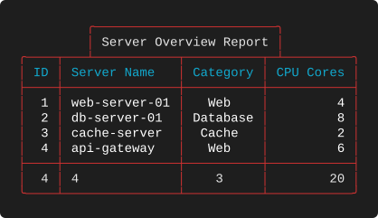
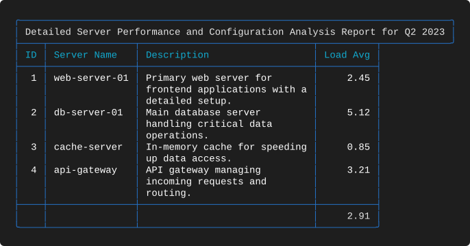
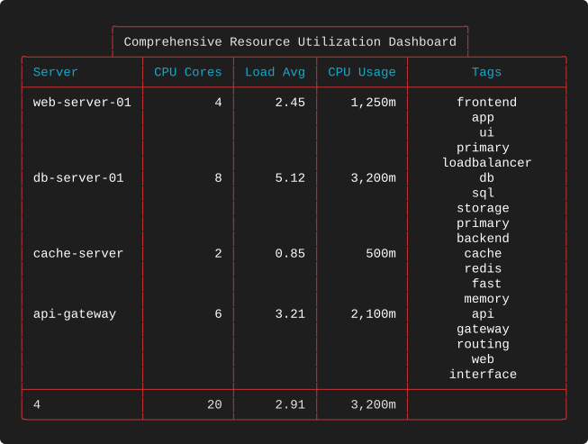
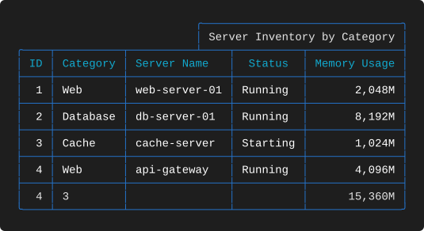

# Examples 05 — Titles

[← Combined Features](EXAMPLES_04.md) · [Examples index](EXAMPLES.md) · [Next: Title Geometry →](EXAMPLES_06.md)

A title is not a line of text above the table — it is a second box welded onto the top
border, and the join is computed so that the two frames share edges cleanly. Suite 05
introduces titles in realistic layouts: centred, right-aligned, full-width, wider than the
table and narrower than it. [Suite 06](EXAMPLES_06.md) then works through the geometry
systematically.

**Source:** [`tests/scenarios/suite_05/`](tests/scenarios/suite_05) · **Examples:** 5 ·
**Run the suite:** `bash tests/run_tests.sh 05`

---

## The data

All five examples share the same four-row inventory.

```json
[
  {
    "id": 1,
    "server_name": "web-server-01",
    "category": "Web",
    "cpu_cores": 4,
    "load_avg": 2.45,
    "cpu_usage": "1250m",
    "memory_usage": "2048Mi",
    "status": "Running",
    "description": "Primary web server for frontend applications with a detailed setup.",
    "tags": "frontend,app,ui,primary,loadbalancer"
  },
  {
    "id": 2,
    "server_name": "db-server-01",
    "category": "Database",
    "cpu_cores": 8,
    "load_avg": 5.12,
    "cpu_usage": "3200m",
    "memory_usage": "8192Mi",
    "status": "Running",
    "description": "Main database server handling critical data operations.",
    "tags": "db,sql,storage,primary,backend"
  },
  {
    "id": 3,
    "server_name": "cache-server",
    "category": "Cache",
    "cpu_cores": 2,
    "load_avg": 0.85,
    "cpu_usage": "500m",
    "memory_usage": "1024Mi",
    "status": "Starting",
    "description": "In-memory cache for speeding up data access.",
    "tags": "cache,redis,fast,memory"
  },
  {
    "id": 4,
    "server_name": "api-gateway",
    "category": "Web",
    "cpu_cores": 6,
    "load_avg": 3.21,
    "cpu_usage": "2100m",
    "memory_usage": "4096Mi",
    "status": "Running",
    "description": "API gateway managing incoming requests and routing.",
    "tags": "api,gateway,routing,web,interface"
  }
]
```

## How a title is sized and placed

Two fields control everything:

* `title` — the text, which may contain `{COLOR}` placeholders and `$(command)`
  substitutions.
* `title_position` — one of `left`, `center`, `right`, `full`, or omitted.

The title box is the text plus one space of padding on each side plus two border
characters, so a 22-character title produces a 26-character box. What happens when that
box does not match the table width depends on the position:

| Position | Box narrower than table | Box wider than table |
|----------|-------------------------|----------------------|
| omitted | Drawn at the left, table width unchanged | **Box extends past the table**; the title is not clipped |
| `left` | Drawn at the left | Title is **clipped** to the table width |
| `center` | Centred over the table | Title is **clipped** to the table width |
| `right` | Drawn at the right | Title is **clipped** to the table width |
| `full` | Box spans the table width, text centred inside | Title is **clipped** to the table width |

An over-wide title is always clipped from the head — the first *n* characters survive —
whatever position is named. The position governs where a title that *fits* is placed; once
the text has been cut down to exactly the table width there is nothing left to align.
Footers behave differently in this one respect and are covered in
[suite 08](EXAMPLES_08.md#8-i--over-wide-footer-center).

Omitting `title_position` is therefore *not* the same as writing `"left"`. The former lets
a long title overhang the table; the latter cuts it off. Both are useful, and
[6-C versus 6-F](EXAMPLES_06.md#6-c--an-over-wide-title-with-no-position) shows the two
side by side.

---

## 5-A — A centred title narrower than the table
**What it demonstrates.** The common case: a short descriptive title centred over a table
that also carries a summary row.

**Layout** — `tests/scenarios/suite_05/test_5_A_layout.json`

```json
{
  "theme": "Red",
  "title": "Server Overview Report",
  "title_position": "center",
  "columns": [
    {
      "header": "ID",
      "key": "id",
      "datatype": "int",
      "justification": "right",
      "summary": "count"
    },
    {
      "header": "Server Name",
      "key": "server_name",
      "datatype": "text",
      "justification": "left",
      "summary": "count"
    },
    {
      "header": "Category",
      "key": "category",
      "datatype": "text",
      "justification": "center",
      "summary": "unique"
    },
    {
      "header": "CPU Cores",
      "key": "cpu_cores",
      "datatype": "num",
      "justification": "right",
      "summary": "sum"
    }
  ]
}
```

**Output**



**What to look for**

* The title box is 26 characters over a 45-character table, so it is inset nine characters
  from the left.
* The table's top border is not a plain line. Where the title box lands, the border rises
  into it — `╭────┬───┴───────────┬──────────┬─┴─────────╮` — so the two boxes share a wall
  rather than being stacked. Those `┴` junctions are placed by measuring, and they are the
  first thing to break in a badly ported implementation.
* Column separators that fall *underneath* the title box still appear, as `┴`. The table's
  own structure is never suppressed to accommodate the title.
* Title and summary coexist without interacting: the title is measured against the table
  width, and the table width already accounts for the summary row.

---

## 5-B — A title wider than the table
**What it demonstrates.** What omitting `title_position` buys you — a long title that is
allowed to overhang rather than being truncated.

**Layout** — `tests/scenarios/suite_05/test_5_B_layout.json`

```json
{
  "theme": "Blue",
  "title": "Detailed Server Performance and Configuration Analysis Report for Q2 2023",
  "columns": [
    {
      "header": "ID",
      "key": "id",
      "datatype": "int",
      "justification": "right"
    },
    {
      "header": "Server Name",
      "key": "server_name",
      "datatype": "text",
      "justification": "left"
    },
    {
      "header": "Description",
      "key": "description",
      "datatype": "text",
      "justification": "left",
      "width": 30,
      "wrap_mode": "wrap"
    },
    {
      "header": "Load Avg",
      "key": "load_avg",
      "datatype": "float",
      "justification": "right",
      "summary": "avg"
    }
  ]
}
```

**Output**



**What to look for**

* There is no `title_position` in this layout. The 73-character title produces a
  77-character box over a 64-character table, and **the whole title survives**.
* The join now runs the other way. The table's top border meets the underside of the wider
  title box and terminates with `╯` on the right, because the title box is what defines the
  right-hand edge up there.
* The table below is unaffected — no column has been widened to accommodate the title.
* Set `"title_position": "left"` on this layout and the title would instead be cut to
  60 characters. That is the whole difference between the two.

---

## 5-C — A centred title over a wrapped column
**What it demonstrates.** A title on a tall table, where the wrapped `Tags` column has made
the body many lines deep.

**Layout** — `tests/scenarios/suite_05/test_5_C_layout.json`

```json
{
  "theme": "Red",
  "title": "Comprehensive Resource Utilization Dashboard",
  "title_position": "center",
  "columns": [
    {
      "header": "Server",
      "key": "server_name",
      "datatype": "text",
      "justification": "left",
      "summary": "count"
    },
    {
      "header": "CPU Cores",
      "key": "cpu_cores",
      "datatype": "num",
      "justification": "right",
      "summary": "sum"
    },
    {
      "header": "Load Avg",
      "key": "load_avg",
      "datatype": "float",
      "justification": "right",
      "summary": "avg"
    },
    {
      "header": "CPU Usage",
      "key": "cpu_usage",
      "datatype": "kcpu",
      "justification": "right",
      "summary": "max"
    },
    {
      "header": "Tags",
      "key": "tags",
      "datatype": "text",
      "justification": "center",
      "width": 20,
      "wrap_mode": "wrap",
      "wrap_char": ","
    }
  ]
}
```

**Output**



**What to look for**

* A 48-character box centred over a 73-character table. Row height and title placement are
  entirely independent concerns.
* `CPU Usage` carries `"summary": "max"` and reports `3,200m` — the largest single value,
  not a total. Worth noting in a resource table, where a `max` answers "what is the biggest
  consumer?" and a `sum` answers "what is the fleet using?".
* The centred `Tags` column and the centred title are unrelated settings that happen to
  agree here, which makes the table read as deliberately composed.

---

## 5-D — Right-aligned title over a broken table
**What it demonstrates.** `"title_position": "right"`, and how a title sits above a table
whose rows are separated into groups.

**Layout** — `tests/scenarios/suite_05/test_5_D_layout.json`

```json
{
  "theme": "Blue",
  "title": "Server Inventory by Category",
  "title_position": "right",
  "columns": [
    {
      "header": "ID",
      "key": "id",
      "datatype": "int",
      "justification": "right",
      "summary": "count"
    },
    {
      "header": "Category",
      "key": "category",
      "datatype": "text",
      "justification": "left",
      "break": true,
      "summary": "unique"
    },
    {
      "header": "Server Name",
      "key": "server_name",
      "datatype": "text",
      "justification": "left"
    },
    {
      "header": "Status",
      "key": "status",
      "datatype": "text",
      "justification": "center"
    },
    {
      "header": "Memory Usage",
      "key": "memory_usage",
      "datatype": "kmem",
      "justification": "right",
      "summary": "sum"
    }
  ]
}
```

**Output**



**What to look for**

* The 32-character box is flush with the right edge of the 59-character table. The
  title box's right wall and the table's right wall are the same column, so the top border
  closes with `┤` instead of a corner.
* Only the box's left wall lands inside the table, appearing as a single `┴`. Compare with
  5-A, where the box floats in the middle and both walls produce junctions.
* `Category` has `"break": true` and the four rows have four different categories, so every
  row is separated. Combined with the summary rule at the bottom, the table is almost
  entirely horizontal lines — a good illustration of why `break` wants sorted, repeating
  data to be worth using.
* `Category` also carries `"summary": "unique"`, reporting `3`. A column can break *and*
  summarise.

---

## 5-E — A full-width title that overflows
**What it demonstrates.** `"title_position": "full"` with a title longer than the table can
hold — the clipping case.

**Layout** — `tests/scenarios/suite_05/test_5_E_layout.json`

```json
{
  "theme": "Red",
  "title": "Enterprise Server Management System - Detailed Analytics and Performance Metrics for Strategic Planning",
  "title_position": "full",
  "columns": [
    {
      "header": "ID",
      "key": "id",
      "datatype": "int",
      "justification": "right",
      "summary": "min"
    },
    {
      "header": "Server Name",
      "key": "server_name",
      "datatype": "text",
      "justification": "left",
      "summary": "count"
    },
    {
      "header": "Category",
      "key": "category",
      "datatype": "text",
      "justification": "center",
      "summary": "unique"
    },
    {
      "header": "Description",
      "key": "description",
      "datatype": "text",
      "justification": "right",
      "width": 25,
      "wrap_mode": "wrap"
    },
    {
      "header": "CPU Cores",
      "key": "cpu_cores",
      "datatype": "num",
      "justification": "right",
      "summary": "avg"
    },
    {
      "header": "Load Avg",
      "key": "load_avg",
      "datatype": "float",
      "justification": "center",
      "summary": "max"
    }
  ]
}
```

**Output**


**What to look for**

* `full` makes the title box exactly as wide as the table, here 82 characters, so the top
  border is a single unbroken rule with no junctions at all. This is the tidiest title
  style and the one to reach for when you do not want to think about geometry.
* The title is 102 characters and the box holds 78, so it is clipped:
  `… and Performance Metri`. Nothing marks the truncation. When you use `full`, check your
  title against the narrowest table it will ever render.
* Compare with 5-B, where a long title was allowed to overhang because no position was
  given. Same problem, two different policies, chosen by one field.
* `Description` is right-justified and wrapped at width 25, so each of its lines is flush
  right — the wrapped-and-justified behaviour from
  [3-I](EXAMPLES_03.md#3-i--right-justified-delimiter-wrapping) applied to prose.
* `Load Avg` is centred while every other numeric column is right-justified, and the
  summary `max` of `5.12` is centred with it.

---

## Takeaways

* The title is a box, not a line; its width is the text plus four characters.
* Omitting `title_position` allows an over-wide title to overhang the table. Naming a
  position clips it instead.
* `full` sizes the box to the table and centres the text, giving a clean unbroken top
  border.
* Titles never change column widths. The table is measured first; the title is fitted to
  it afterwards.
* Titles compose freely with breaks, summaries and wrapped columns — there are no
  interactions to work around.

---

[← Combined Features](EXAMPLES_04.md) · [Examples index](EXAMPLES.md) · [Next: Title Geometry →](EXAMPLES_06.md)
