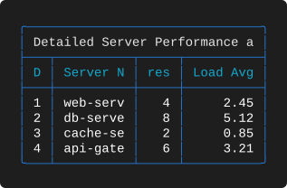

# Examples 06 — Title Geometry

[← Titles](EXAMPLES_05.md) · [Examples index](EXAMPLES.md) · [Next: Footers →](EXAMPLES_07.md)

Suite 06 is a controlled experiment. It renders the same four rows twelve times, varying
only two things: the `title_position` and the relationship between the title's width and
the table's width. The result is a complete map of how the title box behaves, and it is
the reference to reach for when a title is not landing where you expected.

**Source:** [`tests/scenarios/suite_06/`](tests/scenarios/suite_06) · **Examples:** 12 ·
**Run the suite:** `bash tests/run_tests.sh 06`

---

## The data

Deliberately minimal — four rows, four short columns, no summaries, no wrapping. Nothing
competes with the title for attention.

```json
[
  {
    "id": 1,
    "server_name": "web-server-01",
    "cpu_cores": 4,
    "load_avg": 2.45
  },
  {
    "id": 2,
    "server_name": "db-server-01",
    "cpu_cores": 8,
    "load_avg": 5.12
  },
  {
    "id": 3,
    "server_name": "cache-server",
    "cpu_cores": 2,
    "load_avg": 0.85
  },
  {
    "id": 4,
    "server_name": "api-gateway",
    "cpu_cores": 6,
    "load_avg": 3.21
  }
]
```

## The matrix

| | Title narrower than table | Title exactly table width | Title wider than table |
|--|--|--|--|
| **position omitted** | [6-A](#6-a--short-title-no-position) | [6-B](#6-b--title-exactly-as-wide-as-the-table) | [6-C](#6-c--an-over-wide-title-with-no-position) |
| **`left`** | [6-D](#6-d--short-title-left) | [6-E](#6-e--equal-width-title-left) | [6-F](#6-f--over-wide-title-left) |
| **`center`** | [6-G](#6-g--short-title-center) | [6-H](#6-h--equal-width-title-center) | [6-I](#6-i--over-wide-title-center) |
| **`right`** | [6-J](#6-j--short-title-right) | [6-K](#6-k--equal-width-title-right) | [6-L](#6-l--over-wide-title-right-with-an-auto-width-column) |

Three column configurations are used to produce the three width relationships. Each
example below shows only its `title` and `title_position`; the column sets are listed here
once.

**Set α — auto widths (table renders 45 characters wide).** Used by 6-A, 6-D, 6-G and 6-J.

```json
"columns": [
  { "header": "ID",          "key": "id",         "datatype": "int",   "justification": "right" },
  { "header": "Server Name", "key": "server_name","datatype": "text",  "justification": "left"  },
  { "header": "CPU Cores",   "key": "cpu_cores",  "datatype": "num",   "justification": "right" },
  { "header": "Load Avg",    "key": "load_avg",   "datatype": "float", "justification": "right" }
]
```

**Set β — fixed widths 5 / 15 / 10 / 10 (table renders 45 characters wide).** Used by 6-B,
6-E, 6-H and 6-K, whose 41-character title produces a box of exactly 45.

```json
"columns": [
  { "header": "ID",          "key": "id",          "datatype": "int",   "justification": "right", "width": 5  },
  { "header": "Server Name", "key": "server_name", "datatype": "text",  "justification": "left",  "width": 15 },
  { "header": "CPU Cores",   "key": "cpu_cores",   "datatype": "num",   "justification": "right", "width": 10 },
  { "header": "Load Avg",    "key": "load_avg",    "datatype": "float", "justification": "right", "width": 10 }
]
```

**Set γ — fixed widths 3 / 10 / 5 / 5 (table renders 28 characters wide).** Used by 6-C,
6-F and 6-I. 6-C additionally uses longer header text.

**Set δ — fixed widths 3 / 10 / 5 and one auto column (table renders 33 characters wide).**
Used by 6-L.

---

## 6-A — Short title, no position
**Layout delta** — `tests/scenarios/suite_06/test_6_A_layout.json`, column set α

```json
"title": "Server Report"
```

**Output**



**What to look for**

* The final column has no `width`, so it measures itself from `Load Avg` and comes out at
  10 rather than the 5 used in set γ. The table is 33 characters wide instead of 28, and
  the title is therefore clipped to 29 characters — `Detailed Server Performance a` —
  rather than 24.
* **The available title width is a consequence of the column widths.** Change a column,
  change the title. If a title must always show a particular phrase, either pin the column
  widths or omit `title_position` so the box can overhang.
* Like 6-F and 6-I, the clip keeps the head even though the position is `right`, because
  the clip happens before the placement.

---

## Takeaways

* Omitting `title_position` lets an over-wide title overhang the table intact. Naming any
  position clips it to the table width.
* When the title box and the table are the same width, all four positions render
  identically.
* Over-wide titles are clipped head-first regardless of position, because clipping precedes
  placement. Position only matters when there is slack.
* The space available to a title is `table width − 4`, and the table width is decided
  entirely by the columns.
* Pinning column widths to make a title fit can silently clip your headers — check them
  after any width change.

---

[← Titles](EXAMPLES_05.md) · [Examples index](EXAMPLES.md) · [Next: Footers →](EXAMPLES_07.md)
