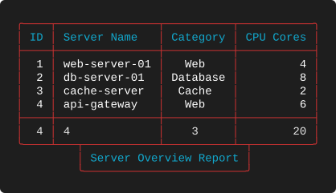
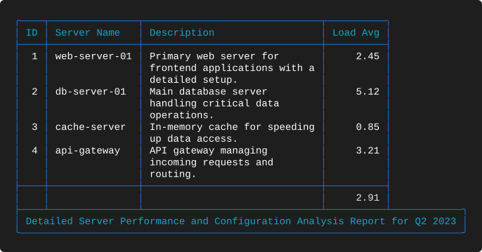
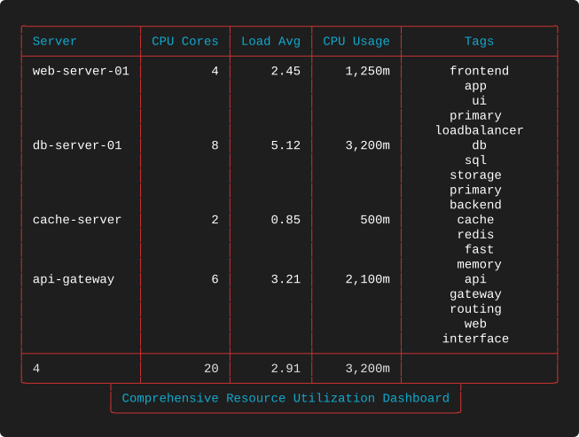
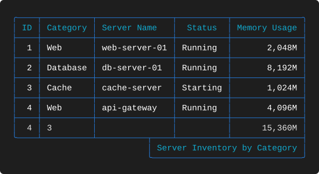
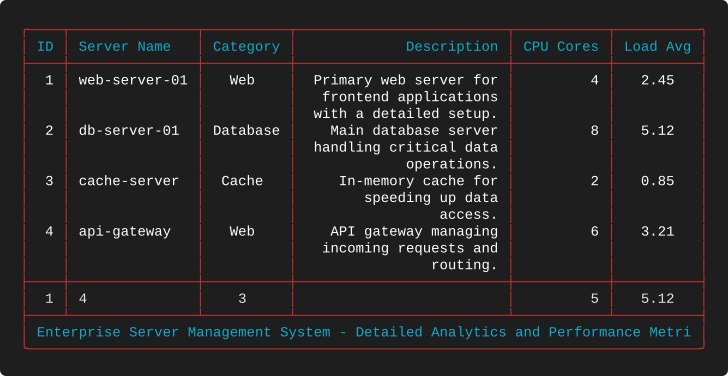

# Examples 07 — Footers

[← Title Geometry](EXAMPLES_06.md) · [Examples index](EXAMPLES.md) · [Next: Footer Geometry →](EXAMPLES_08.md)

Footers are titles turned upside down. Suite 07 mirrors [suite 05](EXAMPLES_05.md) exactly
— the same five layouts, the same data, with `title`/`title_position` replaced by
`footer`/`footer_position` — so the two pages can be read side by side to confirm that the
behaviour really is symmetrical.

**Source:** [`tests/scenarios/suite_07/`](tests/scenarios/suite_07) · **Examples:** 5 ·
**Run the suite:** `bash tests/run_tests.sh 07`

---

## The data

Identical to suite 05.

```json
[
  {
    "id": 1,
    "server_name": "web-server-01",
    "category": "Web",
    "cpu_cores": 4,
    "load_avg": 2.45,
    "cpu_usage": "1250m",
    "memory_usage": "2048Mi",
    "status": "Running",
    "description": "Primary web server for frontend applications with a detailed setup.",
    "tags": "frontend,app,ui,primary,loadbalancer"
  },
  {
    "id": 2,
    "server_name": "db-server-01",
    "category": "Database",
    "cpu_cores": 8,
    "load_avg": 5.12,
    "cpu_usage": "3200m",
    "memory_usage": "8192Mi",
    "status": "Running",
    "description": "Main database server handling critical data operations.",
    "tags": "db,sql,storage,primary,backend"
  },
  {
    "id": 3,
    "server_name": "cache-server",
    "category": "Cache",
    "cpu_cores": 2,
    "load_avg": 0.85,
    "cpu_usage": "500m",
    "memory_usage": "1024Mi",
    "status": "Starting",
    "description": "In-memory cache for speeding up data access.",
    "tags": "cache,redis,fast,memory"
  },
  {
    "id": 4,
    "server_name": "api-gateway",
    "category": "Web",
    "cpu_cores": 6,
    "load_avg": 3.21,
    "cpu_usage": "2100m",
    "memory_usage": "4096Mi",
    "status": "Running",
    "description": "API gateway managing incoming requests and routing.",
    "tags": "api,gateway,routing,web,interface"
  }
]
```

## How a footer is sized and placed

The rules match titles closely:

* Box width is the footer text plus one space of padding on each side plus two border
  characters.
* `footer_position` accepts `left`, `center`, `right`, `full`, or may be omitted.
* Omitting the position lets an over-wide footer extend past the table; naming a position
  clips it to the table width.
* `full` sizes the box to the table and centres short text inside it.

There is one behavioural difference worth flagging. An over-wide *title* is always clipped
from the head regardless of position, whereas an over-wide *footer* keeps the head for
`left` and `full`, the **middle** for `center`, and the **tail** for `right`. Suite 08
demonstrates all three: [8-F](EXAMPLES_08.md#8-f--over-wide-footer-left),
[8-I](EXAMPLES_08.md#8-i--over-wide-footer-center) and
[8-L](EXAMPLES_08.md#8-l--over-wide-footer-right).

The other visible difference is which characters appear at the join. A title box sits above
the table and pushes `┴` junctions up into the top border; a footer box sits below and
pushes `┬` junctions down into the bottom border.

---

## 7-A — A centred footer under a summary row
**What it demonstrates.** The everyday case: a short attribution line centred beneath a
table that already ends in a summary.

**Layout** — `tests/scenarios/suite_07/test_7_A_layout.json`

```json
{
  "theme": "Red",
  "footer": "Server Overview Report",
  "footer_position": "center",
  "columns": [
    {
      "header": "ID",
      "key": "id",
      "datatype": "int",
      "justification": "right",
      "summary": "count"
    },
    {
      "header": "Server Name",
      "key": "server_name",
      "datatype": "text",
      "justification": "left",
      "summary": "count"
    },
    {
      "header": "Category",
      "key": "category",
      "datatype": "text",
      "justification": "center",
      "summary": "unique"
    },
    {
      "header": "CPU Cores",
      "key": "cpu_cores",
      "datatype": "num",
      "justification": "right",
      "summary": "sum"
    }
  ]
}
```

**Output**



**What to look for**

* The bottom border reads `╰────┴───┬───────────┴──────────┴─┬─────────╯`. Three characters
  are doing three different jobs there: `╰` closes the table, `┴` closes a column
  separator, and `┬` opens the wall of the footer box hanging below.
* The 26-character box is centred under a 45-character table, inset nine characters — the
  exact mirror of [5-A](EXAMPLES_05.md#5-a--a-centred-title-narrower-than-the-table).
* The summary row and the footer are separate features. The summary is part of the table;
  the footer is a box attached to it. Neither is aware of the other.

---

## 7-B — A footer wider than the table
**What it demonstrates.** Omitting `footer_position` so a long footer may overhang instead
of being truncated.

**Layout** — `tests/scenarios/suite_07/test_7_B_layout.json`

```json
{
  "theme": "Blue",
  "footer": "Detailed Server Performance and Configuration Analysis Report for Q2 2023",
  "columns": [
    {
      "header": "ID",
      "key": "id",
      "datatype": "int",
      "justification": "right"
    },
    {
      "header": "Server Name",
      "key": "server_name",
      "datatype": "text",
      "justification": "left"
    },
    {
      "header": "Description",
      "key": "description",
      "datatype": "text",
      "justification": "left",
      "width": 30,
      "wrap_mode": "wrap"
    },
    {
      "header": "Load Avg",
      "key": "load_avg",
      "datatype": "float",
      "justification": "right",
      "summary": "avg"
    }
  ]
}
```

**Output**



**What to look for**

* A 77-character box under a 64-character table, with the full 73-character footer intact.
* The bottom border now begins with `├` rather than `╰`: the table's bottom-left corner is
  not a corner any more, because the footer box continues below and to the right of it.
* This layout is [5-B](EXAMPLES_05.md#5-b--a-title-wider-than-the-table) with the title
  moved to the bottom. Compare the two captures — the frames are reflections of each other.

---

## 7-C — A centred footer under a tall table
**What it demonstrates.** A footer beneath a body made tall by delimiter wrapping.

**Layout** — `tests/scenarios/suite_07/test_7_C_layout.json`

```json
{
  "theme": "Red",
  "footer": "Comprehensive Resource Utilization Dashboard",
  "footer_position": "center",
  "columns": [
    {
      "header": "Server",
      "key": "server_name",
      "datatype": "text",
      "justification": "left",
      "summary": "count"
    },
    {
      "header": "CPU Cores",
      "key": "cpu_cores",
      "datatype": "num",
      "justification": "right",
      "summary": "sum"
    },
    {
      "header": "Load Avg",
      "key": "load_avg",
      "datatype": "float",
      "justification": "right",
      "summary": "avg"
    },
    {
      "header": "CPU Usage",
      "key": "cpu_usage",
      "datatype": "kcpu",
      "justification": "right",
      "summary": "max"
    },
    {
      "header": "Tags",
      "key": "tags",
      "datatype": "text",
      "justification": "center",
      "width": 20,
      "wrap_mode": "wrap",
      "wrap_char": ","
    }
  ]
}
```

**Output**



**What to look for**

* A 48-character box centred under a 73-character table. The twenty lines of wrapped tags
  above it are irrelevant to the calculation — only the table's *width* matters.
* Footers are especially useful on tall tables, where the reader reaches the bottom having
  scrolled the header off screen. A footer restating the source or the timestamp is often
  more valuable than the title.
* `CPU Usage` reports `max` (`3,200m`) rather than a total, as in
  [5-C](EXAMPLES_05.md#5-c--a-centred-title-over-a-wrapped-column).

---

## 7-D — Right-aligned footer under a grouped table
**What it demonstrates.** `"footer_position": "right"` beneath a table separated into
groups by a `break` column.

**Layout** — `tests/scenarios/suite_07/test_7_D_layout.json`

```json
{
  "theme": "Blue",
  "footer": "Server Inventory by Category",
  "footer_position": "right",
  "columns": [
    {
      "header": "ID",
      "key": "id",
      "datatype": "int",
      "justification": "right",
      "summary": "count"
    },
    {
      "header": "Category",
      "key": "category",
      "datatype": "text",
      "justification": "left",
      "break": true,
      "summary": "unique"
    },
    {
      "header": "Server Name",
      "key": "server_name",
      "datatype": "text",
      "justification": "left"
    },
    {
      "header": "Status",
      "key": "status",
      "datatype": "text",
      "justification": "center"
    },
    {
      "header": "Memory Usage",
      "key": "memory_usage",
      "datatype": "kmem",
      "justification": "right",
      "summary": "sum"
    }
  ]
}
```

**Output**



**What to look for**

* The 32-character box is flush with the right edge of the 59-character table, so the
  bottom border closes with `┤` and only the box's left wall produces a junction.
* Right-aligned footers read as attributions or timestamps — the terminal equivalent of a
  signature block. Left-aligned ones read as captions.
* Every row is separated because all four categories differ, and `Category` still reports
  `unique` 3 in the summary. Breaks, summaries and footers stack without interference.

---

## 7-E — A full-width footer that overflows
**What it demonstrates.** `"footer_position": "full"` with text longer than the table can
hold.

**Layout** — `tests/scenarios/suite_07/test_7_E_layout.json`

```json
{
  "theme": "Red",
  "footer": "Enterprise Server Management System - Detailed Analytics and Performance Metrics for Strategic Planning",
  "footer_position": "full",
  "columns": [
    {
      "header": "ID",
      "key": "id",
      "datatype": "int",
      "justification": "right",
      "summary": "min"
    },
    {
      "header": "Server Name",
      "key": "server_name",
      "datatype": "text",
      "justification": "left",
      "summary": "count"
    },
    {
      "header": "Category",
      "key": "category",
      "datatype": "text",
      "justification": "center",
      "summary": "unique"
    },
    {
      "header": "Description",
      "key": "description",
      "datatype": "text",
      "justification": "right",
      "width": 25,
      "wrap_mode": "wrap"
    },
    {
      "header": "CPU Cores",
      "key": "cpu_cores",
      "datatype": "num",
      "justification": "right",
      "summary": "avg"
    },
    {
      "header": "Load Avg",
      "key": "load_avg",
      "datatype": "float",
      "justification": "center",
      "summary": "max"
    }
  ]
}
```

**Output**



**What to look for**

* `full` makes the box exactly as wide as the 82-character table, so the join is a single
  unbroken rule with no junction characters at all — the cleanest way to attach a footer.
* The 102-character footer is clipped to the 78 characters the box can hold, ending at
  `… and Performance Metri`. There is no ellipsis; check long footers against your
  narrowest table.
* This is [5-E](EXAMPLES_05.md#5-e--a-full-width-title-that-overflows) inverted, right down
  to the clipped fragment being identical.

---

## Takeaways

* Footers use the same sizing and positioning rules as titles; the clipping rule differs
  only for `center`, which keeps the middle of an over-wide footer.
* The join characters differ — `┬` descending into the bottom border where titles use `┴`
  ascending into the top one — but the geometry is computed the same way.
* Omit `footer_position` to let a long footer overhang; name a position to clip it.
* `full` gives an unbroken join and is the safest choice for generated text of unpredictable
  length.
* A table may carry both a title and a footer; suites [08](EXAMPLES_08.md) and
  [09](EXAMPLES_09.md) exercise that combination extensively.

---

[← Title Geometry](EXAMPLES_06.md) · [Examples index](EXAMPLES.md) · [Next: Footer Geometry →](EXAMPLES_08.md)
