# Examples 08 — Footer Geometry

[← Footers](EXAMPLES_07.md) · [Examples index](EXAMPLES.md) · [Next: Showcase →](EXAMPLES_09.md)

Suite 08 is the largest of the geometry suites. It works through the same position ×
width matrix as [suite 06](EXAMPLES_06.md), adds the two `full` cases that suite 06 leaves
to suite 05, and then moves on to the features that make footers genuinely useful in
production: shell command substitution and Unicode-aware width measurement.

**Source:** [`tests/scenarios/suite_08/`](tests/scenarios/suite_08) · **Examples:** 17 ·
**Run the suite:** `bash tests/run_tests.sh 08`

---

## The data

Examples 8-A through 8-N share a minimal four-row dataset.

```json
[
  {
    "id": 1,
    "server_name": "web-server-01",
    "cpu_cores": 4,
    "load_avg": 2.45
  },
  {
    "id": 2,
    "server_name": "db-server-01",
    "cpu_cores": 8,
    "load_avg": 5.12
  },
  {
    "id": 3,
    "server_name": "cache-server",
    "cpu_cores": 2,
    "load_avg": 0.85
  },
  {
    "id": 4,
    "server_name": "api-gateway",
    "cpu_cores": 6,
    "load_avg": 3.21
  }
]
```

Examples 8-O, 8-P and 8-Q use wider datasets with `memory_gb`, `status` and `location`
fields; those are shown with their examples.

## The matrix

Unlike suite 06, this suite does not pin any column widths. The three width relationships
are produced by varying the *footer text* against a table that is consistently 45
characters wide, which is the more common real-world situation: your columns are what they
are, and the caption has to cope.

| | Footer narrower than table | Footer exactly table width | Footer wider than table |
|--|--|--|--|
| **position omitted** | [8-A](#8-a--short-footer-no-position) | [8-B](#8-b--footer-exactly-as-wide-as-the-table) | [8-C](#8-c--an-over-wide-footer-with-no-position) |
| **`left`** | [8-D](#8-d--short-footer-left) | [8-E](#8-e--equal-width-footer-left) | [8-F](#8-f--over-wide-footer-left) |
| **`center`** | [8-G](#8-g--short-footer-center) | [8-H](#8-h--equal-width-footer-center) | [8-I](#8-i--over-wide-footer-center) |
| **`right`** | [8-J](#8-j--short-footer-right) | [8-K](#8-k--equal-width-footer-right) | [8-L](#8-l--over-wide-footer-right) |
| **`full`** | [8-M](#8-m--full-width-footer-with-a-colour-placeholder) | — | [8-N](#8-n--full-width-footer-that-overflows) |

**Shared column set** for 8-A through 8-N (8-C substitutes longer header text, which is how
it produces a wider table):

```json
"columns": [
  { "header": "ID",          "key": "id",          "datatype": "int",   "justification": "right" },
  { "header": "Server Name", "key": "server_name", "datatype": "text",  "justification": "left"  },
  { "header": "CPU Cores",   "key": "cpu_cores",   "datatype": "num",   "justification": "right" },
  { "header": "Load Avg",    "key": "load_avg",    "datatype": "float", "justification": "right" }
]
```

Each example below lists only the fields that change.

---

## 8-A — Short footer, no position
**Layout delta** — `tests/scenarios/suite_08/test_8_A_layout.json`

```json
"footer": "Summary Report"
```

**Output**

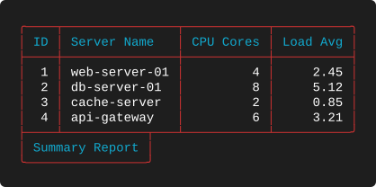

**What to look for**

* An 18-character box under a 45-character table, drawn at the left. With no
  `footer_position`, short footers default to the left edge — identical to
  [8-D](#8-d--short-footer-left).
* The bottom border reads `├────┴───────────┬───┴───────────┴──────────╯`: `├` because the
  footer box hangs from the left corner, `┬` where the box's right wall descends, and `╯`
  closing the table on the right.

---

## 8-B — Footer exactly as wide as the table
**Layout delta** — `tests/scenarios/suite_08/test_8_B_layout.json`

```json
"footer": "Summary Performance Metric Report Data 23"
```

**Output**


**What to look for**

* The 41-character footer produces a 45-character box, exactly matching the table. The
  join collapses to a single clean rule.
* **8-B, 8-E, 8-H and 8-K are byte-identical.** As with the title matrix, once the box
  fills the width there is nothing left for the position to decide.
* Achieving this by counting characters is fragile. `"footer_position": "full"` gets the
  same result on any table — see [8-M](#8-m--full-width-footer-with-a-colour-placeholder).

---

## 8-C — An over-wide footer with no position
**Layout delta** — `tests/scenarios/suite_08/test_8_C_layout.json`, with expanded header
text on every column

```json
"footer": "Detailed Summary Performance and Configuration Analysis Report for Q2 2023"
```

**Output**

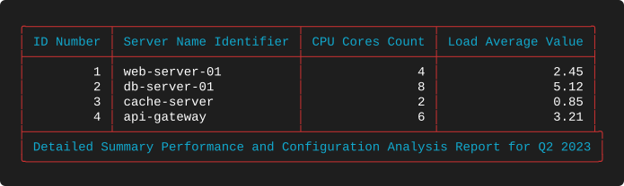

**What to look for**

* The longer headers (`Server Name Identifier`, `Load Average Value`) widen the table to 77
  characters. The 74-character footer needs 78, so the box overhangs by exactly one
  character and the bottom border ends `┴╮` rather than `┴╯`.
* A one-character overhang is the hardest case for a junction calculation to get right,
  which is precisely why the suite includes it.
* Because no position was given, the footer is not clipped. Add `"footer_position": "left"`
  and it would lose its final character instead.

---

## 8-D — Short footer, `left`
**Layout delta** — `tests/scenarios/suite_08/test_8_D_layout.json`

```json
"theme": "Blue",
"footer": "Summary Report",
"footer_position": "left"
```

**Output**

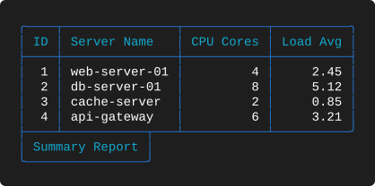

**What to look for**

* Identical to 8-A. For footers that fit, `left` and the default agree.

---

## 8-E — Equal-width footer, `left`
**Layout delta** — `tests/scenarios/suite_08/test_8_E_layout.json`

```json
"theme": "Blue",
"footer": "Summary Performance Metric Report Data 23",
"footer_position": "left"
```

**Output**


**What to look for**

* Identical to 8-B, 8-H and 8-K.

---

## 8-F — Over-wide footer, `left`
**Layout delta** — `tests/scenarios/suite_08/test_8_F_layout.json`

```json
"theme": "Blue",
"footer": "Detailed Summary Performance and Configuration Analysis Report for Q2 2023",
"footer_position": "left"
```

**Output**


**What to look for**

* The 74-character footer is clipped to the 41 characters a 45-wide table can hold:
  `Detailed Summary Performance and Configur`. The head survives.
* The box now matches the table exactly, so the join is a clean rule — clipping to fit
  always produces the same tidy result as `full`.

---

## 8-G — Short footer, `center`
**Layout delta** — `tests/scenarios/suite_08/test_8_G_layout.json`

```json
"footer": "Summary Report",
"footer_position": "center"
```

**Output**

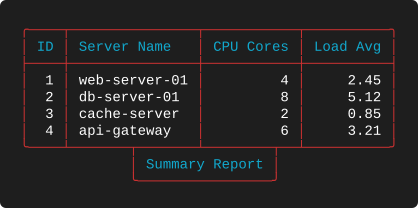

**What to look for**

* The 18-character box is centred under the 45-character table, so both of its walls land
  inside the table and the bottom border carries two `┬` junctions:
  `╰────┴───────┬───────┴────────┬──┴──────────╯`.
* Compare against [6-G](EXAMPLES_06.md#6-g--short-title-center), the title equivalent. The
  junction characters are inverted; everything else is the same.

---

## 8-H — Equal-width footer, `center`
**Layout delta** — `tests/scenarios/suite_08/test_8_H_layout.json`

```json
"footer": "Summary Performance Metric Report Data 23",
"footer_position": "center"
```

**Output**

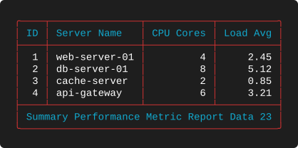

**What to look for**

* Identical to 8-B, 8-E and 8-K.

---

## 8-I — Over-wide footer, `center`
**Layout delta** — `tests/scenarios/suite_08/test_8_I_layout.json`

```json
"footer": "Detailed Summary Performance and Configuration Analysis Report for Q2 2023",
"footer_position": "center"
```

**Output**

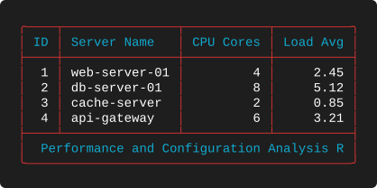

**What to look for**

* Clipped to ` Performance and Configuration Analysis R` — **the middle** of the string,
  with `Detailed Summary` lost from the front and `eport for Q2 2023` from the back.
* This is where footers and titles diverge, and it is worth knowing about. Rendering the
  *same* string as a centred title on the *same* table yields
  `Detailed Summary Performance and Configur` — the head — because the title path clips
  before it places, whereas the footer path clips around the centre. Both behaviours are
  stable and covered by the suite, but they are not symmetrical. If you depend on which
  fragment survives, verify it against the element you are actually using.
* The leading space in the clipped text is real — it is the space that preceded
  `Performance` in the original string, not extra padding.

---

## 8-J — Short footer, `right`
**Layout delta** — `tests/scenarios/suite_08/test_8_J_layout.json`

```json
"theme": "Blue",
"footer": "Summary Report",
"footer_position": "right"
```

**Output**

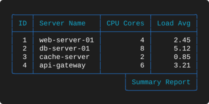

**What to look for**

* The box is flush with the table's right edge, so the bottom border closes with `┤` and
  only the left wall of the box produces a junction:
  `╰────┴───────────────┴─────┬─────┴──────────┤`.
* This is the standard shape for a generated-at or generated-by line.

---

## 8-K — Equal-width footer, `right`
**Layout delta** — `tests/scenarios/suite_08/test_8_K_layout.json`

```json
"theme": "Blue",
"footer": "Summary Performance Metric Report Data 23",
"footer_position": "right"
```

**Output**

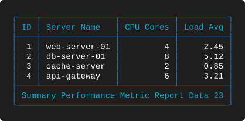

**What to look for**

* The last member of the identical-output group, closing out the equal-width row.

---

## 8-L — Over-wide footer, `right`
**Layout delta** — `tests/scenarios/suite_08/test_8_L_layout.json`

```json
"theme": "Blue",
"footer": "Detailed Summary Performance and Configuration Analysis Report for Q2 2023",
"footer_position": "right"
```

**Output**

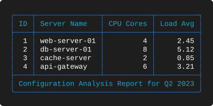

**What to look for**

* Clipped to `Configuration Analysis Report for Q2 2023` — the **tail**, which for a footer
  ending in a date or a report period is usually the part you wanted to keep.
* 8-F, 8-I and 8-L clip the same 74-character string three different ways. Read them in
  sequence: head, middle, tail.

---

## 8-M — Full-width footer with a colour placeholder
**Layout delta** — `tests/scenarios/suite_08/test_8_M_layout.json`

```json
"theme": "Blue",
"footer": "{RED}Summary Report{RESET}",
"footer_position": "full"
```

**Output**

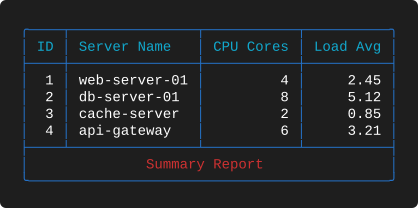

**What to look for**

* `full` stretches the box to the table's 45 characters and **centres** the short text
  inside it. This is different from `center`, which centres a *box* sized to the text;
  `full` centres *text* inside a box sized to the table.
* The `{RED}` and `{RESET}` placeholders do not affect the centring. The footer
  renders in red while staying in exactly the same position.
* For any footer whose length you cannot predict — a timestamp, a hostname, a count —
  `full` is the safe choice: the frame stays rectangular whatever the text turns out to be.

---

## 8-N — Full-width footer that overflows
**Layout delta** — `tests/scenarios/suite_08/test_8_N_layout.json`

```json
"theme": "Blue",
"footer": "Detailed Summary Performance and Configuration Analysis Report for Q2 2023 which is a very long footer text to test clipping behavior in full position",
"footer_position": "full"
```

**Output**

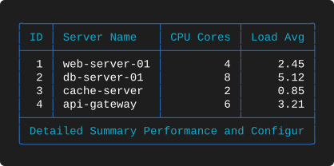

**What to look for**

* A 150-character footer in a box that holds 41. The result is
  `Detailed Summary Performance and Configur` — **identical to 8-F**, because `full` clips
  head-first just as `left` does.
* `full` therefore protects the frame but not the content. It guarantees a rectangular
  table; it does not guarantee your footer is readable.

---

## 8-O — Command substitution in a footer
**What it demonstrates.** `$(...)` inside footer text is executed and its output
interpolated before the table is measured.

**Data** — `tests/scenarios/suite_08/test_8_O_data.json`

```json
[
  {
    "id": 1,
    "server_name": "web-server-01",
    "cpu_cores": 4,
    "memory_gb": 16,
    "load_avg": 2.45,
    "status": "Active",
    "location": "US-East"
  },
  {
    "id": 2,
    "server_name": "db-server-01",
    "cpu_cores": 8,
    "memory_gb": 32,
    "load_avg": 5.12,
    "status": "Active",
    "location": "US-West"
  },
  {
    "id": 3,
    "server_name": "cache-server",
    "cpu_cores": 2,
    "memory_gb": 8,
    "load_avg": 0.85,
    "status": "Standby",
    "location": "EU-Central"
  }
]
```

**Layout** — `tests/scenarios/suite_08/test_8_O_layout.json`

```json
{
  "theme": "Blue",
  "footer": "Date: $(date +%A) Date: $(date '+%B %d') Time: $(date '+%H:%M:%S')",
  "footer_position": "right",
  "columns": [
    {
      "header": "ID",
      "key": "id",
      "datatype": "int",
      "justification": "right"
    },
    {
      "header": "Server Name",
      "key": "server_name",
      "datatype": "text",
      "justification": "left"
    },
    {
      "header": "CPU Cores",
      "key": "cpu_cores",
      "datatype": "num",
      "justification": "right"
    },
    {
      "header": "Memory (GB)",
      "key": "memory_gb",
      "datatype": "num",
      "justification": "right"
    },
    {
      "header": "Load Avg",
      "key": "load_avg",
      "datatype": "float",
      "justification": "right"
    },
    {
      "header": "Status",
      "key": "status",
      "datatype": "text",
      "justification": "center"
    },
    {
      "header": "Location",
      "key": "location",
      "datatype": "text",
      "justification": "left"
    }
  ]
}
```

**Output**

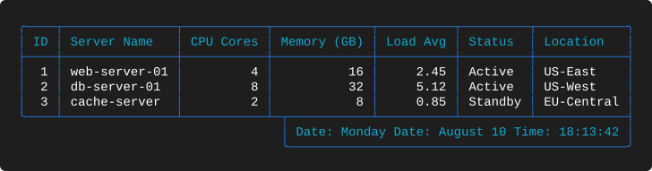

**What to look for**

* Three separate `date` invocations are substituted into one footer, producing something
  like `Date: Monday Date: August 10 Time: 15:29:04`. Your output will differ — this is
  live shell execution, which is why the comparison harness normalises dates and times
  before diffing.
* The substitution happens **before** width measurement, so the box is sized to the
  resolved text. A footer that fits today may overflow tomorrow if the substituted content
  gets longer; if that matters, use `full`.
* The table itself is wider here (seven columns, 82 characters) and the footer is
  right-aligned beneath it.
* Command substitution runs with the privileges of the process rendering the table. Treat
  layout files as executable content and do not render layouts you did not write.

---

## 8-P — Command substitution in both title and footer
**What it demonstrates.** Dynamic content at both ends of the table, combined with colour
placeholders used as decorative separators.

**Data** — `tests/scenarios/suite_08/test_8_P_data.json`

```json
[
  {
    "id": 1,
    "server_name": "web-server-01",
    "cpu_cores": 4,
    "memory_gb": 16,
    "load_avg": 2.45,
    "status": "Active",
    "location": "US-East"
  },
  {
    "id": 2,
    "server_name": "db-server-01",
    "cpu_cores": 8,
    "memory_gb": 32,
    "load_avg": 5.12,
    "status": "Active",
    "location": "US-West"
  }
]
```

**Layout** — `tests/scenarios/suite_08/test_8_P_layout.json`

```json
{
  "theme": "Red",
  "title": "Report {RED}──{NC} $(date '+%Y-%m-%d %H:%M:%S')",
  "title_position": "center",
  "footer": "End {RED}──{NC} $(date +%A) {RED}──{NC} $(date '+%B %d') {RED}──{NC} $(date '+%H:%M:%S')",
  "footer_position": "right",
  "columns": [
    {
      "header": "ID",
      "key": "id",
      "datatype": "int",
      "justification": "right"
    },
    {
      "header": "Server Name",
      "key": "server_name",
      "datatype": "text",
      "justification": "left"
    },
    {
      "header": "CPU Cores",
      "key": "cpu_cores",
      "datatype": "num",
      "justification": "right"
    },
    {
      "header": "Memory (GB)",
      "key": "memory_gb",
      "datatype": "num",
      "justification": "right"
    },
    {
      "header": "Load Avg",
      "key": "load_avg",
      "datatype": "float",
      "justification": "right"
    },
    {
      "header": "Status",
      "key": "status",
      "datatype": "text",
      "justification": "center"
    },
    {
      "header": "Location",
      "key": "location",
      "datatype": "text",
      "justification": "left"
    }
  ]
}
```

**Output**

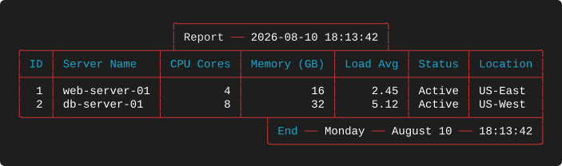

**What to look for**

* `{RED}──{NC}` is a coloured box-drawing separator embedded in the text. Because the
  placeholders contribute zero width and `──` contributes two, the title and footer measure
  correctly and the boxes land where they should.
* The title is centred and the footer right-aligned on the same table, each sized
  independently from its own resolved text.
* `{NC}` is used here where earlier examples used `{RESET}`. The two are interchangeable.
* Only two data rows, so the dynamic boxes dominate the output — which is the point of the
  scenario.

---

## 8-Q — Unicode in title and footer
**What it demonstrates.** The same layout as 8-P with an emoji added to the title and
dingbat check marks around the footer, exercising the display-width logic.

**Layout** — `tests/scenarios/suite_08/test_8_Q_layout.json`

```json
{
  "theme": "Red",
  "title": "Report {RED}──{NC} $(date '+%Y-%m-%d %H:%M:%S') 😊",
  "title_position": "center",
  "footer": "✓ End {RED}──{NC} $(date +%A) {RED}──{NC} $(date '+%B %d') {RED}──{NC} $(date '+%H:%M:%S') ✓",
  "footer_position": "right",
  "columns": [
    {
      "header": "ID",
      "key": "id",
      "datatype": "int",
      "justification": "right"
    },
    {
      "header": "Server Name",
      "key": "server_name",
      "datatype": "text",
      "justification": "left"
    },
    {
      "header": "CPU Cores",
      "key": "cpu_cores",
      "datatype": "num",
      "justification": "right"
    },
    {
      "header": "Memory (GB)",
      "key": "memory_gb",
      "datatype": "num",
      "justification": "right"
    },
    {
      "header": "Load Avg",
      "key": "load_avg",
      "datatype": "float",
      "justification": "right"
    },
    {
      "header": "Status",
      "key": "status",
      "datatype": "text",
      "justification": "center"
    },
    {
      "header": "Location",
      "key": "location",
      "datatype": "text",
      "justification": "left"
    }
  ]
}
```

**Output**

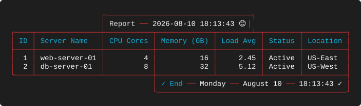

**What to look for**

* The 😊 emoji counts as **two** display columns, not one and not the four bytes of its
  UTF-8 encoding. The title box is correspondingly two characters wider than 8-P's and the
  right wall still lands exactly on the border.
* The ✓ dingbats around the footer count as **one** column each. Getting emoji and dingbats
  right requires per-codepoint width classification rather than a blanket rule for
  non-ASCII characters.
* The `──` separators are box-drawing characters, single-width, and unaffected.
* If a future implementation measured by bytes, this table would be the first to break: the
  boxes would be drawn too wide and every junction below them would drift.

---

## Takeaways

* Footers follow the title matrix: omitted overhangs, named positions clip, equal widths
  render identically whatever the position.
* An over-wide footer clips head-first for `left` and `full`, tail-first for `right`, and
  genuinely centred for `center`.
* `full` centres short text in a table-width box and is the robust choice for generated
  content.
* `$(...)` in a title or footer is executed by the renderer before measurement. Layout files
  are executable content — treat them accordingly.
* Widths are measured in display columns, so emoji occupy two and dingbats one.

---

[← Footers](EXAMPLES_07.md) · [Examples index](EXAMPLES.md) · [Next: Showcase →](EXAMPLES_09.md)
