# Examples 09 — Showcase

[← Footer Geometry](EXAMPLES_08.md) · [Examples index](EXAMPLES.md)

Suite 09 is the gallery. Twenty-two complete reports, each combining a title, a footer,
summaries and at least one of grouping, wrapping or dynamic content. Where the earlier
suites isolate a single behaviour, these are the tables you would actually ship — and
collectively they are the broadest regression net in the project, because almost every
code path in the renderer is exercised by at least one of them.

**Source:** [`tests/scenarios/suite_09/`](tests/scenarios/suite_09) · **Examples:** 22 ·
**Run the suite:** `bash tests/run_tests.sh 09`

---

## The data

Every example reads the same five-row dataset. It is the richest in the project: server
metadata, Kubernetes quantities, prose descriptions, a comma-separated tag list, a
location suitable for grouping, an uptime counter and a floating-point bandwidth figure.

```json
[
  {
    "id": 1,
    "server_name": "web-server-01",
    "category": "Web",
    "cpu_cores": 4,
    "load_avg": 2.45,
    "cpu_usage": "1250m",
    "memory_usage": "2048Mi",
    "status": "Running",
    "description": "Primary web server for frontend applications with a detailed setup for high availability.",
    "tags": "frontend,app,ui,primary,loadbalancer",
    "location": "US-East",
    "uptime_days": 120,
    "bandwidth_mbps": 1000.5
  },
  {
    "id": 2,
    "server_name": "db-server-01",
    "category": "Database",
    "cpu_cores": 8,
    "load_avg": 5.12,
    "cpu_usage": "3200m",
    "memory_usage": "8192Mi",
    "status": "Running",
    "description": "Main database server handling critical data operations with replication enabled.",
    "tags": "db,sql,storage,primary,backend",
    "location": "US-West",
    "uptime_days": 180,
    "bandwidth_mbps": 500.25
  },
  {
    "id": 3,
    "server_name": "cache-server",
    "category": "Cache",
    "cpu_cores": 2,
    "load_avg": 0.85,
    "cpu_usage": "500m",
    "memory_usage": "1024Mi",
    "status": "Starting",
    "description": "In-memory cache for speeding up data access across multiple services.",
    "tags": "cache,redis,fast,memory",
    "location": "EU-Central",
    "uptime_days": 10,
    "bandwidth_mbps": 200.75
  },
  {
    "id": 4,
    "server_name": "api-gateway",
    "category": "Web",
    "cpu_cores": 6,
    "load_avg": 3.21,
    "cpu_usage": "2100m",
    "memory_usage": "4096Mi",
    "status": "Running",
    "description": "API gateway managing incoming requests and routing to appropriate services.",
    "tags": "api,gateway,routing,web,interface",
    "location": "US-East",
    "uptime_days": 90,
    "bandwidth_mbps": 750.0
  },
  {
    "id": 5,
    "server_name": "backup-server",
    "category": "Storage",
    "cpu_cores": 4,
    "load_avg": 1.15,
    "cpu_usage": "800m",
    "memory_usage": "4096Mi",
    "status": "Running",
    "description": "Dedicated backup server for periodic data snapshots and recovery.",
    "tags": "backup,storage,recovery,secondary",
    "location": "US-West",
    "uptime_days": 200,
    "bandwidth_mbps": 300.0
  }
]
```

Some recurring values worth memorising, because they appear in summary rows throughout the
page: five rows; `cpu_cores` sums to **24** and averages **4.8**; `load_avg` averages
**2.56**; `cpu_usage` sums to **7,850m**; `memory_usage` sums to **19,456M**;
`bandwidth_mbps` sums to **2,751.50**; `uptime_days` averages **120**; there are **4**
distinct categories, **3** distinct locations and **2** distinct statuses.

Anything containing a date or a time in the captures below was produced by live shell
substitution and will differ when you run it.

---

## 9-A — A layout generated by a shell script
**What it demonstrates.** A layout that is *computed* rather than stored. Instead of a
`.json` file, the scenario supplies a `.sh` script that receives the data file as `$1` and
prints JSON on stdout.

**Layout script** — `tests/scenarios/suite_09/test_9_A_layout.sh`

```bash
#!/usr/bin/env bash
server_count=$(jq length "$1")
cat << EOF
{
  "theme": "Red",
  "title": "Server Overview Report - Total Servers: $server_count",
  "title_position": "center",
  "footer": "Generated on $(date +%Y-%m-%d)",
  "footer_position": "center",
  "columns": [
    {
      "header": "ID",
      "key": "id",
      "datatype": "int",
      "justification": "right",
      "summary": "count"
    },
    {
      "header": "Server Name",
      "key": "server_name",
      "datatype": "text",
      "justification": "left",
      "summary": "count"
    },
    {
      "header": "Category",
      "key": "category",
      "datatype": "text",
      "justification": "center",
      "summary": "unique"
    },
    {
      "header": "CPU Cores",
      "key": "cpu_cores",
      "datatype": "num",
      "justification": "right",
      "summary": "sum"
    }
  ]
}
EOF
```

**Command**

```bash
bash tests/scenarios/suite_09/test_9_A_layout.sh \
     tests/scenarios/suite_09/test_9_A_data.json > /tmp/9A_layout.json
./tables.c/tables /tmp/9A_layout.json tests/scenarios/suite_09/test_9_A_data.json
```

**Output**


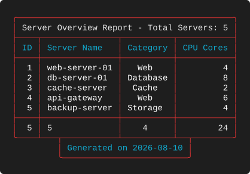

**What to look for**

* The title reads `Total Servers: 5`. That number was produced by `jq length` against the
  data file *before* the renderer ever ran — the layout inspected its own input.
* This is the escape hatch for anything the layout schema cannot express: conditional
  columns, a title that reflects the contents, widths chosen from the data.
* The programs themselves take only JSON. Generating that JSON from a script is a
  convention of the test harness (and a good one for your own tooling), not a feature of
  the renderer.
* Compare with [9-C](#9-c--full-width-title-with-a-generated-footer), which achieves
  something similar with `$(...)` inside a static layout. Use substitution for simple
  values; use a script when you need logic.

---

## 9-B — Left title, right footer, wrapped prose
**What it demonstrates.** The most conventional report shape in the suite: a caption at
top left, an attribution at bottom right, and a wrapped description column.

**Layout** — `tests/scenarios/suite_09/test_9_B_layout.json`

```json
{
  "theme": "Blue",
  "title": "Server Performance Report Q2 2023",
  "title_position": "left",
  "footer": "Data Compiled by IT Department",
  "footer_position": "right",
  "columns": [
    {
      "header": "ID",
      "key": "id",
      "datatype": "int",
      "justification": "right"
    },
    {
      "header": "Server Name",
      "key": "server_name",
      "datatype": "text",
      "justification": "left"
    },
    {
      "header": "Description",
      "key": "description",
      "datatype": "text",
      "justification": "left",
      "width": 30,
      "wrap_mode": "wrap"
    },
    {
      "header": "Load Avg",
      "key": "load_avg",
      "datatype": "float",
      "justification": "right",
      "summary": "avg"
    }
  ]
}
```

**Output**


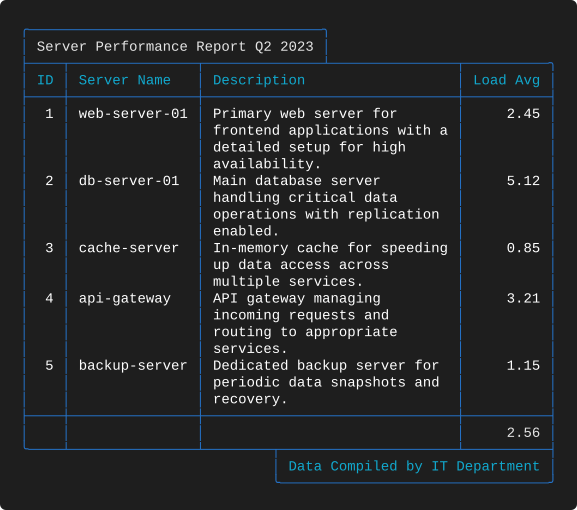

**What to look for**

* Title and footer are positioned independently and neither matches the other's alignment.
  The frame handles both joins without either being aware of the other.
* `Load Avg` is the only summarised column, reporting `avg` 2.56. The other three summary
  cells are blank but still framed.
* At `"width": 30` the descriptions wrap to three or four lines each, giving the table an
  even rhythm without any explicit row separators.

---

## 9-C — Full-width title with a generated footer
**What it demonstrates.** An over-wide `full` title alongside a footer built with command
substitution.

**Layout** — `tests/scenarios/suite_09/test_9_C_layout.json`

```json
{
  "theme": "Red",
  "title": "Comprehensive Resource Utilization Dashboard for Enterprise Systems Monitoring",
  "title_position": "full",
  "footer": "Data Accurate as of $(date '+%Y-%m-%d %H:%M:%S')",
  "footer_position": "center",
  "columns": [
    {
      "header": "Server",
      "key": "server_name",
      "datatype": "text",
      "justification": "left",
      "summary": "count"
    },
    {
      "header": "CPU Cores",
      "key": "cpu_cores",
      "datatype": "num",
      "justification": "right",
      "summary": "sum"
    },
    {
      "header": "Load Avg",
      "key": "load_avg",
      "datatype": "float",
      "justification": "right",
      "summary": "avg"
    },
    {
      "header": "CPU Usage",
      "key": "cpu_usage",
      "datatype": "kcpu",
      "justification": "right",
      "summary": "max"
    },
    {
      "header": "Tags",
      "key": "tags",
      "datatype": "text",
      "justification": "center",
      "width": 20,
      "wrap_mode": "wrap",
      "wrap_char": ","
    }
  ]
}
```

**Output**


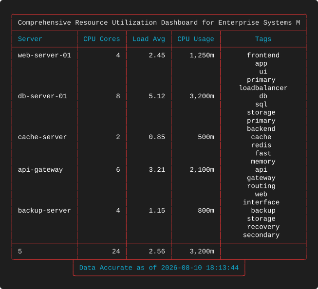

**What to look for**

* The 78-character title is clipped to `… for Enterprise Systems M` because `full` sizes the
  box to the 73-character table. The word `Monitoring` is lost mid-token — `full` protects
  the frame, never the sentence.
* The footer resolves `$(date '+%Y-%m-%d %H:%M:%S')` at render time and is then centred as
  a normal short footer.
* `CPU Usage` reports `max` (`3,200m`) while `CPU Cores` reports `sum` (24) — two different
  questions about the same fleet, answered in the same row.
* Twenty-plus body lines from the comma-wrapped `Tags` column, with no breaks to divide
  them. Compare with [9-I](#9-i--grouping-by-location).

---

## 9-D — Right title and right footer over grouped rows
**What it demonstrates.** Both captions right-aligned, over a table where every row is its
own group.

**Layout** — `tests/scenarios/suite_09/test_9_D_layout.json`

```json
{
  "theme": "Blue",
  "title": "Server Inventory by Category",
  "title_position": "right",
  "footer": "Report Generated for Internal Use Only",
  "footer_position": "right",
  "columns": [
    {
      "header": "ID",
      "key": "id",
      "datatype": "int",
      "justification": "right",
      "summary": "count"
    },
    {
      "header": "Category",
      "key": "category",
      "datatype": "text",
      "justification": "left",
      "break": true,
      "summary": "unique"
    },
    {
      "header": "Server Name",
      "key": "server_name",
      "datatype": "text",
      "justification": "left"
    },
    {
      "header": "Status",
      "key": "status",
      "datatype": "text",
      "justification": "center"
    },
    {
      "header": "Memory Usage",
      "key": "memory_usage",
      "datatype": "kmem",
      "justification": "right",
      "summary": "sum"
    }
  ]
}
```

**Output**


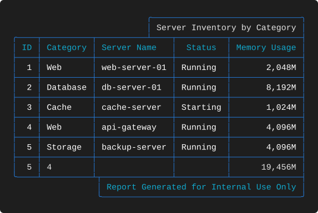

**What to look for**

* `Category` breaks on five consecutive distinct values, so a rule is drawn between every
  pair of rows. The effect is a striped table rather than grouped one — a reminder that
  `break` without `sort` describes transitions, not groups.
* Memory totals `19,456M` and the category count is `4` (two rows are `Web`).
* Both boxes are flush right, so the top and bottom borders each close with a single
  junction on the right and a plain corner on the left.

---

## 9-E — Short centred title, full-width footer
**What it demonstrates.** Asymmetric caption treatment, and a clipped `full` footer whose
final token happens to be a substituted year.

**Layout** — `tests/scenarios/suite_09/test_9_E_layout.json`

```json
{
  "theme": "Red",
  "title": "Enterprise Server Management System",
  "title_position": "center",
  "footer": "Detailed Analytics and Performance Metrics for Strategic Planning - IT Dept. $(date +%Y)",
  "footer_position": "full",
  "columns": [
    {
      "header": "ID",
      "key": "id",
      "datatype": "int",
      "justification": "right",
      "summary": "min"
    },
    {
      "header": "Server Name",
      "key": "server_name",
      "datatype": "text",
      "justification": "left",
      "summary": "count"
    },
    {
      "header": "Category",
      "key": "category",
      "datatype": "text",
      "justification": "center",
      "summary": "unique"
    },
    {
      "header": "Description",
      "key": "description",
      "datatype": "text",
      "justification": "right",
      "width": 25,
      "wrap_mode": "wrap"
    },
    {
      "header": "CPU Cores",
      "key": "cpu_cores",
      "datatype": "num",
      "justification": "right",
      "summary": "avg"
    },
    {
      "header": "Load Avg",
      "key": "load_avg",
      "datatype": "float",
      "justification": "center",
      "summary": "max"
    }
  ]
}
```

**Output**


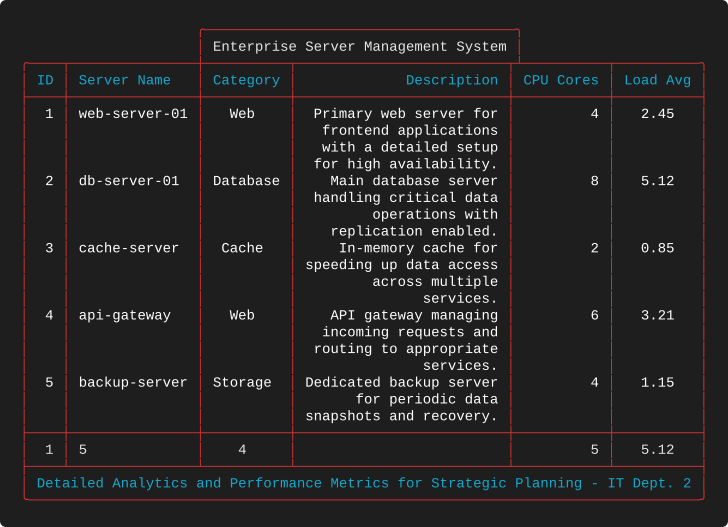

**What to look for**

* The footer ends `IT Dept. 2`. The `$(date +%Y)` substitution produced a four-digit year
  and the clip then removed three of its digits. Dynamic content is resolved first and
  clipped afterwards, which is exactly the case to watch for when a footer is close to the
  table width.
* The title box is 37 characters, centred over an 82-character table; the footer box is the
  full 82. One table, two different caption strategies.
* `Description` is right-justified and wrapped at 25, and `Load Avg` is centred — the
  summary values follow the same alignments as the bodies above them.

---

## 9-F — Left title and left footer
**What it demonstrates.** Both captions on the left, and a `float` column carrying a `sum`.

**Layout** — `tests/scenarios/suite_09/test_9_F_layout.json`

```json
{
  "theme": "Blue",
  "title": "Network Bandwidth Analysis",
  "title_position": "left",
  "footer": "Data Source: Network Monitoring System",
  "footer_position": "left",
  "columns": [
    {
      "header": "ID",
      "key": "id",
      "datatype": "int",
      "justification": "right",
      "summary": "count"
    },
    {
      "header": "Server",
      "key": "server_name",
      "datatype": "text",
      "justification": "left"
    },
    {
      "header": "Bandwidth (Mbps)",
      "key": "bandwidth_mbps",
      "datatype": "float",
      "justification": "right",
      "summary": "sum"
    },
    {
      "header": "Location",
      "key": "location",
      "datatype": "text",
      "justification": "center",
      "summary": "unique"
    }
  ]
}
```

**Output**


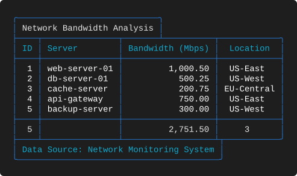

**What to look for**

* `Bandwidth (Mbps)` totals `2,751.50`. A `float` summary keeps two decimals *and* picks up
  thousands separators once it crosses 1,000.
* `Location` reports `unique` 3, centred beneath centred values.
* `Server` has no summary, so the summary row reads `5`, blank, `2,751.50`, `3` — a
  perfectly normal mixture.
* Both boxes on the left produce the tidiest possible pair of joins: one junction each,
  both near the left corner.

---

## 9-G — Uptime with a centred title and footer
**What it demonstrates.** Symmetric captions, and an `avg` over an integer column that
happens to divide exactly.

**Layout** — `tests/scenarios/suite_09/test_9_G_layout.json`

```json
{
  "theme": "Red",
  "title": "Server Uptime Report",
  "title_position": "center",
  "footer": "Uptime Data as of Today",
  "footer_position": "center",
  "columns": [
    {
      "header": "Server Name",
      "key": "server_name",
      "datatype": "text",
      "justification": "left",
      "summary": "count"
    },
    {
      "header": "Uptime (Days)",
      "key": "uptime_days",
      "datatype": "int",
      "justification": "right",
      "summary": "avg"
    },
    {
      "header": "Status",
      "key": "status",
      "datatype": "text",
      "justification": "center"
    },
    {
      "header": "Category",
      "key": "category",
      "datatype": "text",
      "justification": "center",
      "summary": "unique"
    }
  ]
}
```

**Output**


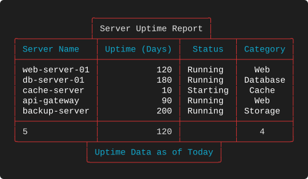

**What to look for**

* `Uptime (Days)` averages 600 ÷ 5 = **120** exactly, so the integer rounding described in
  [2-G](EXAMPLES_02.md#2-g--every-summary-over-an-integer-column) is invisible here.
  Change any single uptime value and it becomes visible immediately.
* `Status` has no summary while `Category` reports `unique` 4 — the blank cell sits between
  two populated ones.
* Title and footer boxes are both centred but are different widths, so their junctions land
  in different places. Nothing is aligned between the two.

---

## 9-H — Full-width title centred over a wide table
**What it demonstrates.** `full` behaving well: a short title in a table-width box.

**Layout** — `tests/scenarios/suite_09/test_9_H_layout.json`

```json
{
  "theme": "Blue",
  "title": "Detailed Server Specifications",
  "title_position": "full",
  "footer": "Specifications Compiled for Review",
  "footer_position": "right",
  "columns": [
    {
      "header": "ID",
      "key": "id",
      "datatype": "int",
      "justification": "right",
      "summary": "count"
    },
    {
      "header": "Server",
      "key": "server_name",
      "datatype": "text",
      "justification": "left"
    },
    {
      "header": "CPU Cores",
      "key": "cpu_cores",
      "datatype": "num",
      "justification": "right",
      "summary": "sum"
    },
    {
      "header": "Memory",
      "key": "memory_usage",
      "datatype": "kmem",
      "justification": "right",
      "summary": "sum"
    },
    {
      "header": "Description",
      "key": "description",
      "datatype": "text",
      "justification": "left",
      "width": 25,
      "wrap_mode": "wrap"
    }
  ]
}
```

**Output**


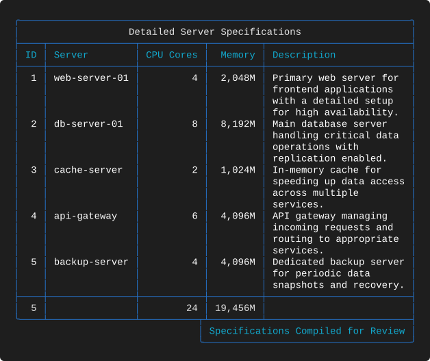

**What to look for**

* The title is 30 characters in a 70-character box, so it is centred with generous space on
  both sides and the top border is a single unbroken rule. This is `full` at its best.
* Contrast with [9-C](#9-c--full-width-title-with-a-generated-footer) and
  [9-N](#9-n--over-wide-full-width-title), where the same setting truncates. `full` is only
  as safe as your title is short.
* `Memory` totals `19,456M` and `CPU Cores` totals 24, both right-justified beneath
  right-justified bodies.

---

## 9-I — Grouping by location
**What it demonstrates.** A `break` on a geographic column, with a centred title and
footer.

**Layout** — `tests/scenarios/suite_09/test_9_I_layout.json`

```json
{
  "theme": "Red",
  "title": "Server Distribution by Location",
  "title_position": "center",
  "footer": "Location Data for Infrastructure Planning",
  "footer_position": "center",
  "columns": [
    {
      "header": "ID",
      "key": "id",
      "datatype": "int",
      "justification": "right",
      "summary": "count"
    },
    {
      "header": "Location",
      "key": "location",
      "datatype": "text",
      "justification": "left",
      "break": true,
      "summary": "unique"
    },
    {
      "header": "Server Name",
      "key": "server_name",
      "datatype": "text",
      "justification": "left"
    },
    {
      "header": "CPU Cores",
      "key": "cpu_cores",
      "datatype": "num",
      "justification": "right",
      "summary": "sum"
    },
    {
      "header": "Load Avg",
      "key": "load_avg",
      "datatype": "float",
      "justification": "right",
      "summary": "avg"
    }
  ]
}
```

**Output**


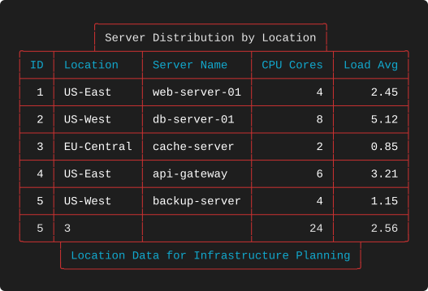

**What to look for**

* The locations run `US-East`, `US-West`, `EU-Central`, `US-East`, `US-West` — every
  adjacent pair differs, so every row is separated. Sorting by `location` first would
  produce three genuine groups instead of five stripes.
* `Location` breaks *and* summarises, reporting `unique` 3. Those two settings are
  independent and can disagree with what you see, which is the clearest possible argument
  for pairing `break` with `sort`.
* Even fully striped, the table stays legible because the load and core columns are narrow
  and right-aligned.

---

## 9-J — Status report with `max` uptime
**What it demonstrates.** A compact four-column status view with a centred title and a
right footer.

**Layout** — `tests/scenarios/suite_09/test_9_J_layout.json`

```json
{
  "theme": "Blue",
  "title": "Server Status Report",
  "title_position": "center",
  "footer": "Status Updated Hourly",
  "footer_position": "right",
  "columns": [
    {
      "header": "ID",
      "key": "id",
      "datatype": "int",
      "justification": "right",
      "summary": "count"
    },
    {
      "header": "Server Name",
      "key": "server_name",
      "datatype": "text",
      "justification": "left"
    },
    {
      "header": "Status",
      "key": "status",
      "datatype": "text",
      "justification": "center",
      "summary": "unique"
    },
    {
      "header": "Uptime (Days)",
      "key": "uptime_days",
      "datatype": "int",
      "justification": "right",
      "summary": "max"
    }
  ]
}
```

**Output**


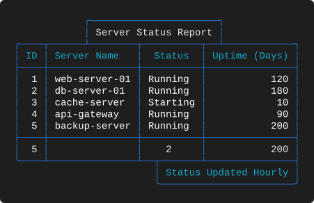

**What to look for**

* `Uptime (Days)` reports `max` 200 rather than an average — "what is our longest-running
  host?" is a different question from "how stable are we on average?", and this is the same
  column answering it.
* `Status` reports `unique` 2, which is the single most useful cell in an operational
  table: anything other than the expected number means something changed.
* Four columns, five rows, no wrapping: this is the smallest layout in the suite and a good
  starting point to copy.

---

## 9-K — Metrics dashboard with a full-width footer
**What it demonstrates.** A left title with a `full` footer that overflows.

**Layout** — `tests/scenarios/suite_09/test_9_K_layout.json`

```json
{
  "theme": "Red",
  "title": "Performance Metrics Dashboard",
  "title_position": "left",
  "footer": "Performance Data for System Optimization and Capacity Planning - IT Operations Team",
  "footer_position": "full",
  "columns": [
    {
      "header": "Server",
      "key": "server_name",
      "datatype": "text",
      "justification": "left",
      "summary": "count"
    },
    {
      "header": "CPU Usage",
      "key": "cpu_usage",
      "datatype": "kcpu",
      "justification": "right",
      "summary": "sum"
    },
    {
      "header": "Load Avg",
      "key": "load_avg",
      "datatype": "float",
      "justification": "right",
      "summary": "avg"
    },
    {
      "header": "Bandwidth (Mbps)",
      "key": "bandwidth_mbps",
      "datatype": "float",
      "justification": "right",
      "summary": "max"
    }
  ]
}
```

**Output**


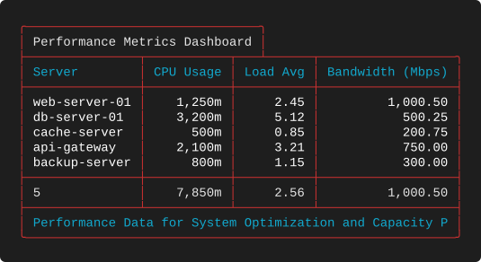

**What to look for**

* The footer is clipped to `… Optimization and Capacity P`. As always with `full`, the head
  survives.
* Three different aggregations across three numeric types: `sum` on `kcpu` (`7,850m`), `avg`
  on `float` (2.56) and `max` on `float` (`1,000.50`).
* `Bandwidth (Mbps)` is the widest column and is driven by its header, not its data — the
  summary `1,000.50` is only eight characters.

---

## 9-L — Category breakdown with a left footer
**What it demonstrates.** Grouped rows with both captions on the left, and a footer whose
box is exactly one character narrower than the table.

**Layout** — `tests/scenarios/suite_09/test_9_L_layout.json`

```json
{
  "theme": "Blue",
  "title": "Server Category Breakdown",
  "title_position": "left",
  "footer": "Category Analysis for Resource Allocation",
  "footer_position": "left",
  "columns": [
    {
      "header": "ID",
      "key": "id",
      "datatype": "int",
      "justification": "right",
      "summary": "count"
    },
    {
      "header": "Category",
      "key": "category",
      "datatype": "text",
      "justification": "left",
      "break": true,
      "summary": "unique"
    },
    {
      "header": "Server",
      "key": "server_name",
      "datatype": "text",
      "justification": "left"
    },
    {
      "header": "CPU Cores",
      "key": "cpu_cores",
      "datatype": "num",
      "justification": "right",
      "summary": "sum"
    },
    {
      "header": "Memory",
      "key": "memory_usage",
      "datatype": "kmem",
      "justification": "right",
      "summary": "sum"
    }
  ]
}
```

**Output**


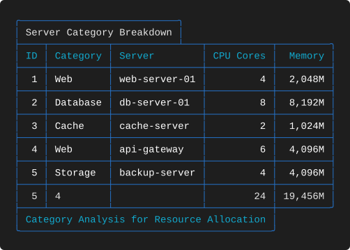

**What to look for**

* The footer box is 43 characters under a 55-character table, so the bottom border shows a
  `┼` where the box's right wall coincides with a column separator — a different junction
  character from the `┬` seen elsewhere, chosen because a column boundary is already there.
* `Category` breaks on all five rows and reports `unique` 4.
* `Memory` totals `19,456M`; `CPU Cores` totals 24.

---

## 9-M — Right title, centred footer, centred `kcpu`
**What it demonstrates.** A centred Kubernetes column and an `avg` on `num` that needs
rounding.

**Layout** — `tests/scenarios/suite_09/test_9_M_layout.json`

```json
{
  "theme": "Red",
  "title": "Resource Utilization Overview",
  "title_position": "right",
  "footer": "Resource Data for Capacity Planning",
  "footer_position": "center",
  "columns": [
    {
      "header": "Server Name",
      "key": "server_name",
      "datatype": "text",
      "justification": "left",
      "summary": "count"
    },
    {
      "header": "CPU Cores",
      "key": "cpu_cores",
      "datatype": "num",
      "justification": "right",
      "summary": "avg"
    },
    {
      "header": "CPU Usage",
      "key": "cpu_usage",
      "datatype": "kcpu",
      "justification": "center",
      "summary": "sum"
    },
    {
      "header": "Memory Usage",
      "key": "memory_usage",
      "datatype": "kmem",
      "justification": "right",
      "summary": "sum"
    }
  ]
}
```

**Output**


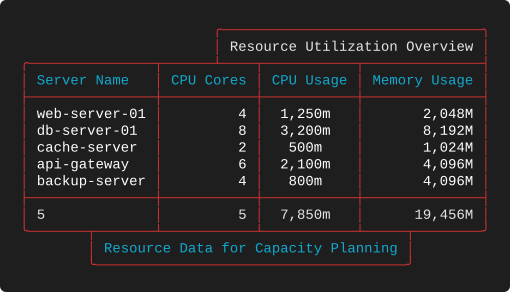

**What to look for**

* `CPU Cores` reports `avg` **5**. The true mean is 4.8; the column is `num`, so the result
  is rounded to a whole number exactly as in
  [2-G](EXAMPLES_02.md#2-g--every-summary-over-an-integer-column). Declare the column
  `float` if you need the decimal.
* `CPU Usage` is centred rather than right-justified, so `1,250m` and `500m` no longer line
  up on their suffixes. The total `7,850m` is centred with them. Compare the neighbouring
  `Memory Usage` column to see what right-justification buys you.
* The title box is flush right and the footer box centred — the two junctions are in
  completely different places, which is fine.

---

## 9-N — Over-wide full-width title
**What it demonstrates.** The `full` truncation case again, this time cutting cleanly at a
word boundary by luck rather than design.

**Layout** — `tests/scenarios/suite_09/test_9_N_layout.json`

```json
{
  "theme": "Blue",
  "title": "Network Bandwidth Utilization Report for All Data Centers and Regions Worldwide",
  "title_position": "full",
  "footer": "Bandwidth Metrics for Network Optimization",
  "footer_position": "left",
  "columns": [
    {
      "header": "ID",
      "key": "id",
      "datatype": "int",
      "justification": "right",
      "summary": "count"
    },
    {
      "header": "Server",
      "key": "server_name",
      "datatype": "text",
      "justification": "left"
    },
    {
      "header": "Location",
      "key": "location",
      "datatype": "text",
      "justification": "center",
      "summary": "unique"
    },
    {
      "header": "Bandwidth (Mbps)",
      "key": "bandwidth_mbps",
      "datatype": "float",
      "justification": "right",
      "summary": "sum"
    }
  ]
}
```

**Output**


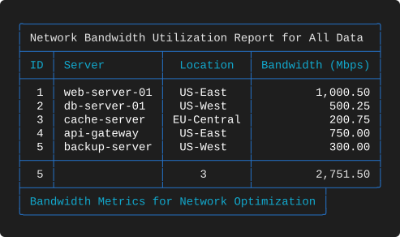

**What to look for**

* `Network Bandwidth Utilization Report for All Data Centers and Regions Worldwide` is cut
  to `… Report for All Data ` — the trailing space is kept, because the clip counts
  characters and does not trim.
* `Bandwidth (Mbps)` totals `2,751.50` and `Location` reports `unique` 3.
* The footer is left-aligned and short, so the bottom border carries a single junction.

---

## 9-O — A catalogue of descriptions
**What it demonstrates.** The narrowest useful report: three columns, one of them prose,
with a summary row that is almost entirely blank.

**Layout** — `tests/scenarios/suite_09/test_9_O_layout.json`

```json
{
  "theme": "Red",
  "title": "Server Descriptions Catalog",
  "title_position": "right",
  "footer": "Descriptions for Documentation",
  "footer_position": "right",
  "columns": [
    {
      "header": "ID",
      "key": "id",
      "datatype": "int",
      "justification": "right",
      "summary": "count"
    },
    {
      "header": "Server Name",
      "key": "server_name",
      "datatype": "text",
      "justification": "left"
    },
    {
      "header": "Description",
      "key": "description",
      "datatype": "text",
      "justification": "left",
      "width": 30,
      "wrap_mode": "wrap"
    }
  ]
}
```

**Output**


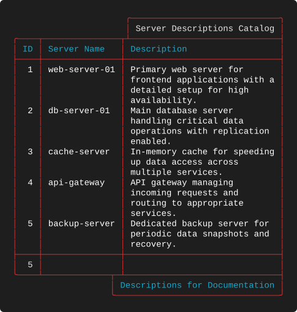

**What to look for**

* Only `ID` is summarised, so the summary row reads `5` followed by two empty cells. The
  rule above it is still drawn full width.
* If a nearly empty summary row bothers you, the alternative is to remove the `summary`
  entirely — the row disappears with it. There is no way to keep a total on one column and
  suppress the rule.
* Both captions are right-aligned, and the title box's left wall lands directly on a column
  separator, producing a `┴` at that exact position.

---

## 9-P — Tag analysis with centred wrapping
**What it demonstrates.** Centred delimiter wrapping in a real report — the technique from
[3-J](EXAMPLES_03.md#3-j--centred-delimiter-wrapping) with captions attached.

**Layout** — `tests/scenarios/suite_09/test_9_P_layout.json`

```json
{
  "theme": "Blue",
  "title": "Server Tag Analysis",
  "title_position": "center",
  "footer": "Tag Data for Classification",
  "footer_position": "center",
  "columns": [
    {
      "header": "Server",
      "key": "server_name",
      "datatype": "text",
      "justification": "left",
      "summary": "count"
    },
    {
      "header": "Category",
      "key": "category",
      "datatype": "text",
      "justification": "center",
      "summary": "unique"
    },
    {
      "header": "Tags",
      "key": "tags",
      "datatype": "text",
      "justification": "center",
      "width": 25,
      "wrap_mode": "wrap",
      "wrap_char": ","
    }
  ]
}
```

**Output**


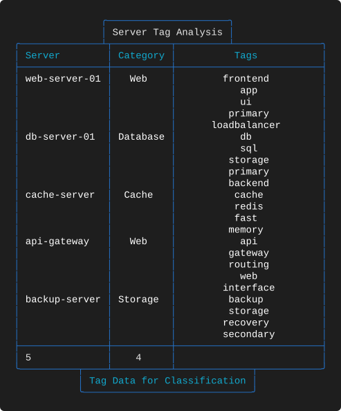

**What to look for**

* Twenty-three body lines from five data rows. Each tag is centred in a 23-character field,
  producing a stack of labels rather than a list.
* At this width no tag is clipped, unlike suite 03 where the same values were squeezed into
  a 13-character column. Wrapping is only as good as the width you give it.
* `Server` reports `count` 5 and `Category` reports `unique` 4; `Tags` carries no summary.

---

## 9-Q — Mixed datatypes grouped by location
**What it demonstrates.** `kcpu` and `float` in the same table, grouped by a text column,
with a `full` footer carrying a substituted year.

**Layout** — `tests/scenarios/suite_09/test_9_Q_layout.json`

```json
{
  "theme": "Red",
  "title": "Mixed Data Type Analysis",
  "title_position": "left",
  "footer": "Comprehensive Server Data for All Metrics and Categories - IT Operations $(date +%Y)",
  "footer_position": "full",
  "columns": [
    {
      "header": "ID",
      "key": "id",
      "datatype": "int",
      "justification": "right",
      "summary": "count"
    },
    {
      "header": "Location",
      "key": "location",
      "datatype": "text",
      "justification": "left",
      "break": true,
      "summary": "unique"
    },
    {
      "header": "Server",
      "key": "server_name",
      "datatype": "text",
      "justification": "left"
    },
    {
      "header": "CPU Usage",
      "key": "cpu_usage",
      "datatype": "kcpu",
      "justification": "right",
      "summary": "sum"
    },
    {
      "header": "Bandwidth",
      "key": "bandwidth_mbps",
      "datatype": "float",
      "justification": "right",
      "summary": "avg"
    }
  ]
}
```

**Output**


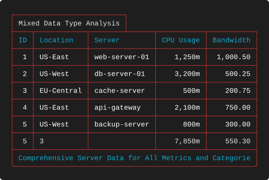

**What to look for**

* `Bandwidth` reports `avg` **550.30** — 2,751.50 ÷ 5 — with the decimal preserved because
  the column is `float`. Set beside 9-M's rounded `num` average, this is the clearest
  side-by-side illustration of why the datatype matters for summaries.
* `CPU Usage` totals `7,850m` in the same row.
* The footer is clipped to `… and Categorie`, losing both the tail of the word and the
  substituted year entirely.

---

## 9-R — Uptime analysis with two unique counts
**What it demonstrates.** Two `unique` summaries in one table, on columns with different
justifications.

**Layout** — `tests/scenarios/suite_09/test_9_R_layout.json`

```json
{
  "theme": "Blue",
  "title": "Detailed Uptime Analysis",
  "title_position": "center",
  "footer": "Uptime Metrics for Reliability Assessment",
  "footer_position": "right",
  "columns": [
    {
      "header": "ID",
      "key": "id",
      "datatype": "int",
      "justification": "right",
      "summary": "count"
    },
    {
      "header": "Server Name",
      "key": "server_name",
      "datatype": "text",
      "justification": "left"
    },
    {
      "header": "Uptime (Days)",
      "key": "uptime_days",
      "datatype": "int",
      "justification": "right",
      "summary": "avg"
    },
    {
      "header": "Status",
      "key": "status",
      "datatype": "text",
      "justification": "center",
      "summary": "unique"
    },
    {
      "header": "Location",
      "key": "location",
      "datatype": "text",
      "justification": "left",
      "summary": "unique"
    }
  ]
}
```

**Output**


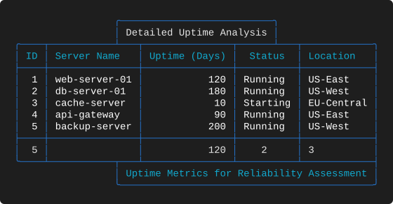

**What to look for**

* `Status` reports `unique` 2 centred, `Location` reports `unique` 3 left-aligned. Each
  summary sits under its own column's alignment, so the two counts are not visually
  related — which is correct, since they count different things.
* `Uptime (Days)` averages 120, and `Server Name` has no summary at all.
* A centred title and a right footer, both comfortably narrower than the 62-character
  table.

---

## 9-S — The full dashboard
**What it demonstrates.** The most feature-dense table in the project: seven columns, a
`full` title, a `full` footer with substitution, grouping, wrapping and four summaries.

**Layout** — `tests/scenarios/suite_09/test_9_S_layout.json`

```json
{
  "theme": "Red",
  "title": "Ultimate Server Dashboard - All Metrics and Insights for Enterprise IT Management",
  "title_position": "full",
  "footer": "Complete Server Data for Strategic Decision Making - Generated on $(date +%Y-%m-%d)",
  "footer_position": "full",
  "columns": [
    {
      "header": "ID",
      "key": "id",
      "datatype": "int",
      "justification": "right",
      "summary": "count"
    },
    {
      "header": "Category",
      "key": "category",
      "datatype": "text",
      "justification": "left",
      "break": true,
      "summary": "unique"
    },
    {
      "header": "Server",
      "key": "server_name",
      "datatype": "text",
      "justification": "left"
    },
    {
      "header": "Description",
      "key": "description",
      "datatype": "text",
      "justification": "left",
      "width": 20,
      "wrap_mode": "wrap"
    },
    {
      "header": "CPU Cores",
      "key": "cpu_cores",
      "datatype": "num",
      "justification": "right",
      "summary": "sum"
    },
    {
      "header": "Load Avg",
      "key": "load_avg",
      "datatype": "float",
      "justification": "center",
      "summary": "avg"
    },
    {
      "header": "Memory",
      "key": "memory_usage",
      "datatype": "kmem",
      "justification": "right",
      "summary": "sum"
    }
  ]
}
```

**Output**


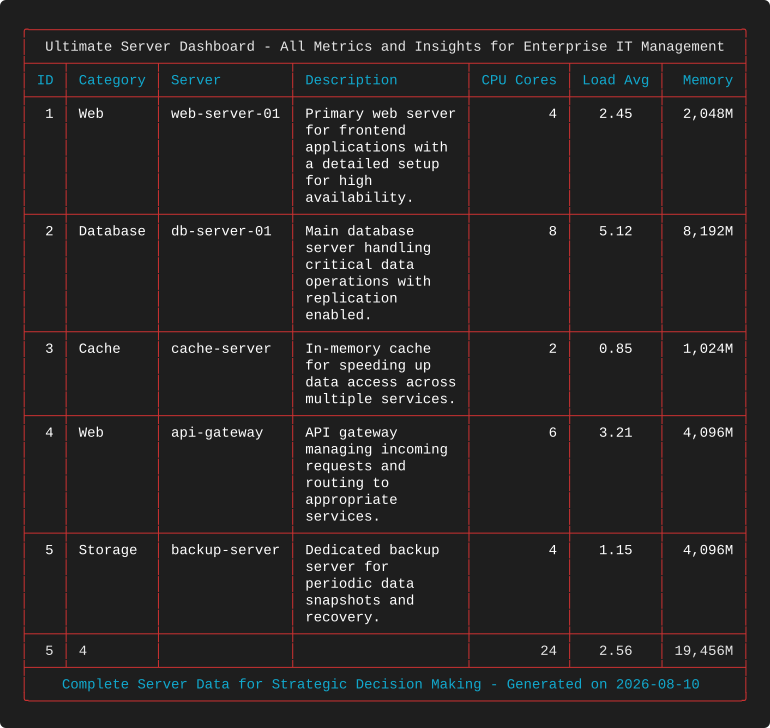

**What to look for**

* Both the title and the footer use `full`, so the table is a clean rectangle 87 characters
  wide with no junction characters at either end. For a dashboard that will be pasted into
  a chat window or an issue, this is the format to use.
* The 81-character title fits inside the 83-character box and is therefore centred rather
  than clipped — the good case of `full`, on a table wide enough to deserve it.
* `Description` at `"width": 20` produces four to six lines per row, and `Category` breaks
  between every one of them, so the table reads as five clearly delimited blocks.
* Four summaries at the bottom: `count` 5, `unique` 4, `sum` 24, `avg` 2.56 and `sum`
  `19,456M`, each formatted by its own column.
* If you want a single example that proves an implementation is correct, this is it. It is
  also the best template in the catalogue for a real operational report.

---

## 9-T — Six columns, six summaries
**What it demonstrates.** A summary on every single column, mixing five aggregation types
and four justifications.

**Layout** — `tests/scenarios/suite_09/test_9_T_layout.json`

```json
{
  "theme": "Blue",
  "title": "Final Showcase of Server Analytics",
  "title_position": "center",
  "footer": "End of Comprehensive Server Report - IT Team $(date +%Y)",
  "footer_position": "center",
  "columns": [
    {
      "header": "ID",
      "key": "id",
      "datatype": "int",
      "justification": "right",
      "summary": "min"
    },
    {
      "header": "Server Name",
      "key": "server_name",
      "datatype": "text",
      "justification": "left",
      "summary": "count"
    },
    {
      "header": "Category",
      "key": "category",
      "datatype": "text",
      "justification": "center",
      "summary": "unique"
    },
    {
      "header": "Status",
      "key": "status",
      "datatype": "text",
      "justification": "right",
      "summary": "unique"
    },
    {
      "header": "CPU Usage",
      "key": "cpu_usage",
      "datatype": "kcpu",
      "justification": "center",
      "summary": "max"
    },
    {
      "header": "Bandwidth",
      "key": "bandwidth_mbps",
      "datatype": "float",
      "justification": "right",
      "summary": "sum"
    }
  ]
}
```

**Output**


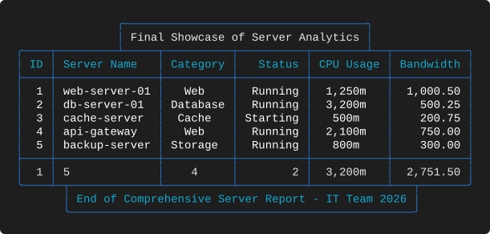

**What to look for**

* Reading the summary row left to right: `min` 1, `count` 5, `unique` 4, `unique` 2, `max`
  `3,200m`, `sum` `2,751.50`. Six columns, six populated cells, no blanks.
* `Status` is right-justified — unusual for text, and it makes the column read as a status
  code rather than a label. Its `unique` count is right-justified with it.
* `CPU Usage` is centred and `Bandwidth` right-justified, so the two numeric columns beside
  each other behave differently on purpose.
* This is [2-G](EXAMPLES_02.md#2-g--every-summary-over-an-integer-column) grown up: the same
  "one aggregation per column" idea, applied to real fields that each deserve a different
  one.

---

## 9-U — Two commands in one footer
**What it demonstrates.** Multiple `$(...)` substitutions in a single footer, one of them a
pipeline — and a `break` on the identifier column.

**Layout** — `tests/scenarios/suite_09/test_9_U_layout.json`

```json
{
  "theme": "Red",
  "title": "Dynamic Dual Command Footer Test",
  "title_position": "center",
  "footer": "Generated on $(date +%Y-%m-%d) at $(uptime | cut -d' ' -f2-3)",
  "footer_position": "center",
  "columns": [
    {
      "header": "ID",
      "key": "id",
      "datatype": "int",
      "justification": "right",
      "summary": "count",
      "break": true
    },
    {
      "header": "Server Name",
      "key": "server_name",
      "datatype": "text",
      "justification": "left"
    },
    {
      "header": "Description",
      "key": "description",
      "datatype": "text",
      "width": 75,
      "wrap_mode": "wrap",
      "justification": "left"
    },
    {
      "header": "CPU Cores",
      "key": "cpu_cores",
      "datatype": "num",
      "justification": "right",
      "summary": "sum"
    }
  ]
}
```

**Output**


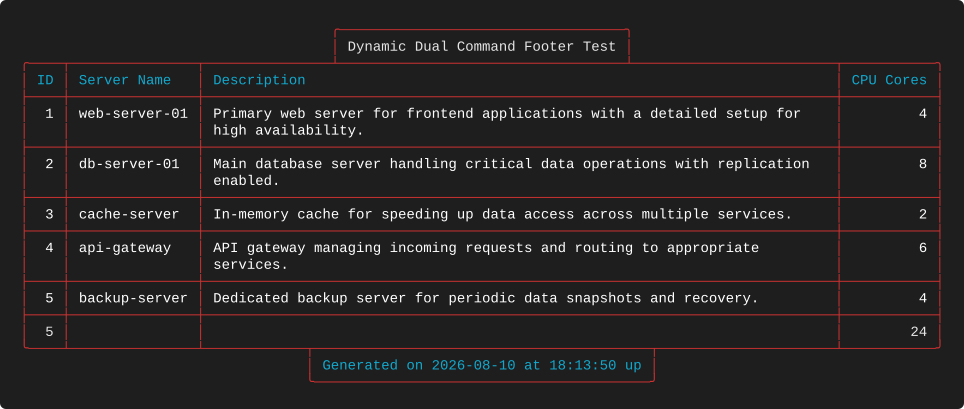

**What to look for**

* The footer runs `$(date +%Y-%m-%d)` and `$(uptime | cut -d' ' -f2-3)` and splices both
  results into one string. Pipes, quoting and multiple commands all work; the whole footer
  is resolved before anything is measured.
* The second substitution's output depends on your system's `uptime` format, so the
  captured text (`… at 15:29:05 up`) will not match yours. That is the trade-off of dynamic
  content: it is live, and therefore not reproducible.
* `ID` carries `"break": true`, and since every identifier is distinct a rule is drawn
  between every row. Breaking on a unique key is the idiom for "separate every record",
  and it is genuinely useful when rows are multiple lines tall — as they are here, thanks
  to the 75-wide wrapped `Description`.
* At 110 characters this is the second-widest table in the catalogue. Wide, wrapped and
  fully separated is a readable combination.

---

## 9-V — An emoji-heavy report
**What it demonstrates.** Emoji in both captions, with no position set on either, so both
boxes are free to overhang the table.

**Layout** — `tests/scenarios/suite_09/test_9_V_layout.json`

```json
{
  "theme": "Red",
  "title": "🚀 Server Status 📊 Performance Report 🌟 $(date +%Y-%m-%d) 💻",
  "footer": "✅ Data Complete 🔥 Analysis Ready 📈 Generated $(date +%H:%M:%S) 🎯",
  "columns": [
    {
      "header": "ID",
      "key": "id",
      "datatype": "int",
      "justification": "right",
      "summary": "count"
    },
    {
      "header": "Server Name",
      "key": "server_name",
      "datatype": "text",
      "justification": "left"
    },
    {
      "header": "Category",
      "key": "category",
      "datatype": "text",
      "justification": "center",
      "summary": "unique"
    },
    {
      "header": "CPU Cores",
      "key": "cpu_cores",
      "datatype": "num",
      "justification": "right",
      "summary": "sum"
    },
    {
      "header": "Status",
      "key": "status",
      "datatype": "text",
      "justification": "center"
    }
  ]
}
```

**Output**


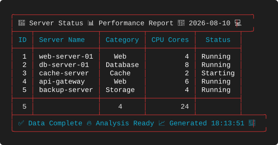

**What to look for**

* Four emoji in the title (🚀 📊 🌟 💻) and four in the footer (✅ 🔥 📈 🎯), each counting
  as **two** display columns. The boxes are sized from the display width, not the byte
  length or the codepoint count.
* Neither caption has a position, so both overhang the 56-character table — the title box
  by three characters and the footer box by four. The borders close with `╯` and `╮`
  accordingly.
* This example is the reason the library carries a full UTF-8 width classifier rather than
  a `strlen`. In a byte-counting implementation every box here would be roughly twice as
  wide as it should be.
* The substituted date and time are the same mechanism as 8-O and 9-U; the interesting part
  is that emoji and substitution compose without either interfering with the other.

---

## Takeaways

* Titles and footers are independent: different positions, different widths, different
  junctions, no interaction.
* `full` at both ends produces a clean rectangle and is the best default for reports that
  will be pasted elsewhere — provided the text fits.
* Dynamic content is resolved before measurement, so a substituted value can push a caption
  over the width limit and be clipped mid-token.
* `break` describes transitions between adjacent rows. Breaking on a unique key separates
  every record; breaking on an unsorted category produces stripes rather than groups.
* Summary formatting follows the column's datatype: `num` and `int` round, `float` keeps
  decimals, `kcpu` and `kmem` keep suffixes and separators.
* Widths are display columns throughout — emoji are two, dingbats and box-drawing
  characters are one.

---

[← Footer Geometry](EXAMPLES_08.md) · [Examples index](EXAMPLES.md)
